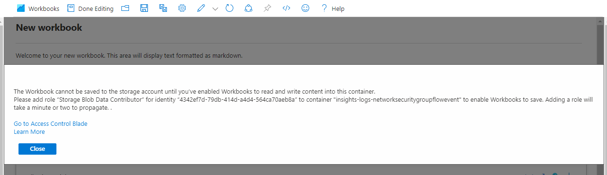

# Bring your own storage to save Workbooks

There are times when you may have a query or some business logic that you want to secure. Workbooks provides an option to secure the workbook by saving the workbook content to your storage which can be encrypted. The storage account is encrypted with Microsoft-managed keys or you can manage the encryption by supplying your own keys. [See Azure documentation](https://docs.microsoft.com/en-us/azure/storage/common/storage-service-encryption)

## Saving Workbook without Identity Setup

1. Create a new workbook.
2. Click on the Save button as before to save the workbook.
    
3. There's an option to `Save content to an Azure Storage Account`, click on the checkbox to save to an Azure Storage Account.
    
4. Select the desire Storage account and Container. The Storage account list is from the Subscription selected above.
    
5. After you've selected your storage options, press `Save` to save your workbook.
6. At this time, workbook will try to save the workbook to the storage but it won't have permission and will popup a dialog box.
    
7. Copy the identity created for the workbook, in this example it's `4342ef7d-79db-414d-a4d4-564ca70aeb8a`, and add/grant this identity to your storage account.
8. Bring up the storage account by navigating to the storage account or click on `Go to Access Control Blade` to bring up the storage account container

9. Click +Add to Add role assignment and add grant the identity `4342ef7d-79db-414d-a4d4-564ca70aeb8a` with `Storage Blob Data Contributor`

10. Now go back to the save dialog and save again.

## There are some limitations and restrictions
+ When a role is added, it may take a few minutes for the permission to propagate.
+ When a workbook is pinned to a dashboard, the query may be saved on the dashboard as well, thus Workbooks will disable pinning if user selects to `Save content to an Azure Storage Account`.
+ If user decides to not storage their workbook in their storage, then they'll need to do a Save As and then delete this workbook.