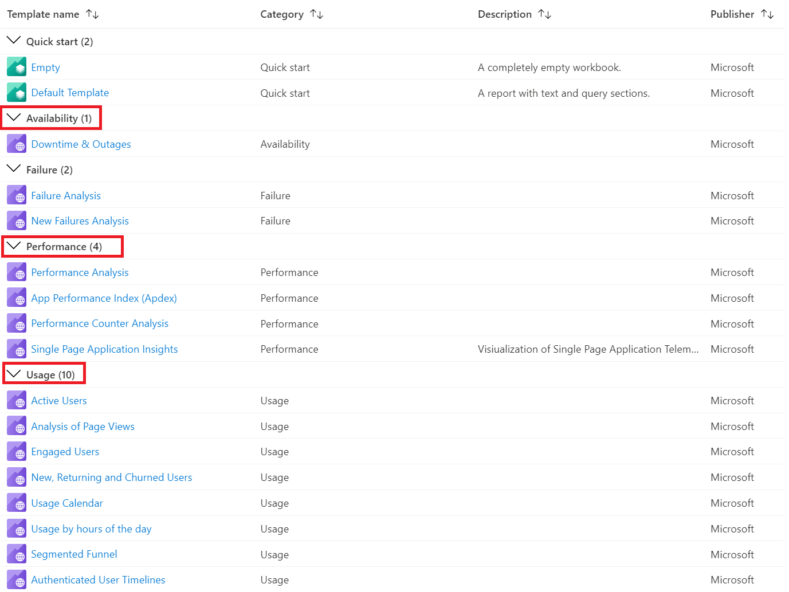
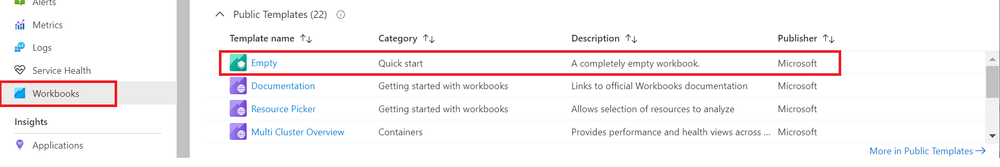
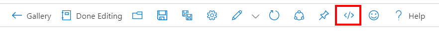
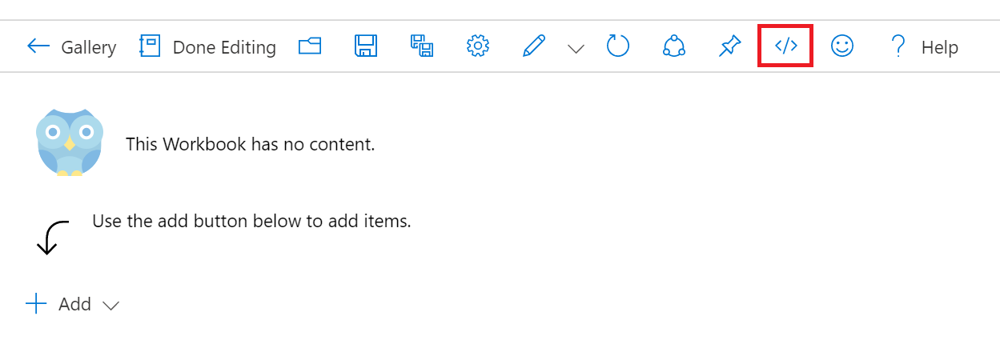

# Contributing to the Template Gallery

If you haven't already read the top level [Contributing](../CONTRIBUTING.md) docs, read that first to find out how to get contributor access to the repo.

## Template Format
Workbook templates follow a certain folder structure.
```
Root
 |
 |- Workbooks
       |- Category A
             |- Template A
                    |- TemplateA.workbook
                    |- icon.svg
             |- Template B
                    |- TemplateB.workbook
                    |- icon.svg
       |- Category B
             |- Template C
                    |- TemplateC.workbook
                    |- icon.svg
             |- Template D
                    |- TemplateD.workbook
                    |- icon.svg
```

## Gallery folder
```
Root
 |- gallery
    | workbooks (workbook type)
        |- Azure Monitor.json (GalleryResourceType)
        |- microsoft.provider-resourcetype.json 
    | insights (etc,other workbook types. not common, verify with workbooks team!)
        |- microsoft.provider-resourcetype.json
        |- galleryB.json
        
...       
```
Each template can live in one or more galleries. The template galleries of the Workbooks tools are organized into categories, like Business Hypotheses, Performance, and Usage. Each category can contain many templates.


## Folder structure
Within the workbooks folder, there is usually a top level folder owned by individual teams or functional areas that contain collections of templates. The exact hierarchy inside each folder is not strictly required, but this is the general practice: each folder has a single workbook inside. The *folder path* to that template becomes its "identifier" inside gallery files

```text
Root
 |- workbooks
    |- AnAreaOfTemplates
        |- Template A
            |- TemplateA.workbook
        |- Template B
            |- TemplateB.workbook
```

so in the above example, there would be template ids of `Commmunity-workbooks/AnAreaOfTemplates/Template A` and `Commmunity-workbooks/AnAreaOfTemplates/Template B` 

Avoid using special characters (like `/\&?`) in your folder names. 

Each template folder should contain a single **.workbook file**. You can create a template file from Workbooks in the Azure portal. See the ["How to create a .workbook file"](#how-to-create-a-workbook-file) section for more details.  Ideally, the filename of the template is the same as its folder name, to make items easier to find by name. Any other files are ignored.

## How to create a .workbook file
There are three ways of creating a template. 
* Create from the default template.
* From the existing template. You can modify or enhance the existing template.
* From the existing report. You can modify or enhance the existing report.

## Create from the default template
1. Go to https://portal.azure.com 
2. Select an Application Insights resource or go to Azure Monitor from the navigation bar
3. Select "Workbooks"
4. Select the Empty template under Quick Start section.

    

5. Modify report as you wish and click "Advanced Editor" button from the menu. 

    

6. Use the download button or copy all contents and create a file like `your custom template name.workbook`. 
   Make sure the file name ends with `.workbook` and avoid using any special characters (like `/\&?`) in your file name.
    

## Create from an existing template
1. Go to https://portal.azure.com 
2. Select an Application Insights resource or Azure Monitor from the navigation bar.
3. Select "Workbooks"
4. Select a template you are interested.
5. Modify report as you wish and click "Advanced Editor" button from the menu. 
6. Use the download button, or copy contents and create a file like `your custom template name.workbook`. 
   Make sure the file name ends with `.workbook` and avoid using any special characters (like `/\&?`) in your file name.
	
## Create from an existing report
1. Go to https://portal.azure.com 
2. Select an Application Insights resource or Azure Monitor from the navigation bar.
3. Select "Workbooks"
4. Click on Open icon from the menu.
5. Select a desired saved report you want to start with.
6. Modify report as you wish and click "Advanced Editor" button from the menu. 
7. Use the download button, or copy contents and create a file like `your custom template name.workbook`. 
   Make sure the file name ends with `.workbook` and avoid using any special characters (like `/\&?`) in your file name.

## Gallery file
 A gallery file associates your templates with a gallery and category. The following is an example of what a gallery file should look like. In the case where you would like to add a template to a gallery that exists, you should modify the existing gallery file.
 ```json
{
    "$schema": "https://raw.githubusercontent.com/microsoft/Application-Insights-Workbooks/master/schema/gallery.json",
    "version": "TemplateGallery/1.0",
    "categories": [
        {
            "id": "MyCategory",
            "name": "My category",
            "templates": [
                {
                    "id": "Workbooks/CategoryA/TemplateA",
                    "name": "My template (preview)",
                    "description": "Description of the template",
                    "author": "Microsoft",
                    "isPreview": true
                }
            ]
        }
    ]
}
```

* `$schema`: The link to the gallery schema. This should be `"https://raw.githubusercontent.com/microsoft/Application-Insights-Workbooks/master/schema/gallery.json"`

* `version`: Gallery version (eg. `TemplateGallery/1.0`)

* `categories`: A list of categories for this gallery. *Note*: The order of categories in this list determines the order of the categories that will appear in this gallery

    * `id`: The ID for the category. This field will not be localized

    * `name`: The name of the category. This field will be localized
    
    * `templates`: A list of templates for the category. *Note*: The order of the templates in this list determines the order of the templates that will appear in this category

        * `id`: The ID for the template. This ID should be the path to your template folder (eg. `Workbooks/Performance/Apdex`)

        * `name`: The name of the template. This field will be localized

        * `description`: The description for the template. This field will be localized

        * `author`: Author for this template (eg. `Microsoft`)

        * `icon`: Optional. If you don't specify "icon" property, it will use the default icon. Otherwise, specify the name of icon file that is located under the template folder.

        * `tags`: Optional. You can specify a list of tags that describes the template.

        * `isPreview`: Optional. Flag to mark the template as preview. See [Testing Preview Workbook Templates](#testing-preview-workbook-templates) for more details

For more details on the schema of the gallery file, view the [Gallery JSON schema](../schema/gallery.json).

## How to create and name a gallery file
Gallery files are created under the `\gallery` folder. A gallery subfolder should be created for each Workbook type. The gallery file should live under the corresponding Workbook type subfolder. The gallery file name is the ARM resource type where slashes in the resource type are replaced with `'-'`.

For example, if your workbook type is 'workbook' and your ARM resource type is 'microsoft-insights/components', then your gallery file should be under the `workbook` subfolder with gallery file named `microsoft.insights-components.json`.

Note: Workbook types are known types, are not arbitrary, and controlled by the Workbooks team. 

### Gallery Restrictions
- A template can be associated with one or more galleries
- A template should only appear once in a category
- A category should only appear once in a gallery

## All Resource Gallery
There is a special case gallery for templates that can be associated with all Azure Resources. You can find this gallery [here](../gallery/all-resource-types/all.json). Templates specified here will be merged with the standard resource type gallery associated with that resource. If you plan to add any templates to this gallery, please test them thoroughly by following the [testing documentation](./Testing.md).

# How to make changes (add, modify templates)

1. Clone the repo, if you haven't already. If you have already, `git checkout master` and `git pull` to make sure you are up to date
2. Create a new branch `git checkout -b nameOfNewBranch`
3. Create a folder in the `Workbooks` folder, or find an existing category folder if you are making a new category
4. Within that folder, create a new folder for your new workbook.  Put your .workbook file there.
    * the "id" for your workbook will be the folder path itself, like `Workbooks\My New Category\My New Workbook\my workbook.workbook` would have an id of `My New Category\My New Workbook`
5. Add your template to a gallery by adding an entry for your category and template in the gallery file under the `\gallery` folder
6. Add your new files to the branch with the appropriate `git add` command
7. Commit your changes to your branch with git commit, with a useful message, like `git commit -m "Adding my new workbook to my new category"`
8. Push your branch to the github repo via git push: `git push -u origin nameOfNewBranch`

# How to test your changes
See [Testing](./Testing.md) on how to test your changes.
# How to publish your changes

1. After you are done, push your branch to the github repo via git push: `git push -u origin nameOfNewBranch`
2. Ensure that if you are adding a new template, it has a corresponding entry in the gallery files.
3. If you are adding a new template and/or gallery file, and you would like to take ownership of the files, add an entry for your team in `CODEOWNERS`. CODEOWNERS entries should be teams, not individuals.
4. In Github, create a pull request for your new branch to master. Again, use useful text for the name of your PR and in the PR, describe what you are changing, what your workbook does, add a screenshot if possible.
5. A validation build will take place to make sure your workbook is valid json, doesn't have hardcoded resource ids, etc.
6. If your build passes, and someone else with write access to the repo approves your PR, complete your PR
7. Upon the next [deployment](Deployment.md), your template will appear in the portal

# Testing Preview Workbook Templates

You can test templates that are still work in progress or simply not ready to be exposed to all users. To do this you need to add the property `"isPreview: true"` in the gallery file.
Here is an example:

```jsonc
{
	"$schema": "https://raw.githubusercontent.com/microsoft/Application-Insights-Workbooks/master/schema/gallery.json",
	"version": "TemplateGallery/1.0",
	"categories": [
		{
			"id": "MyCategory",
			"name": "My category",
			"templates": [
				{
					"id": "Workbooks/CategoryA/TemplateA",
					"name": "My template (preview)",
                    "description": "Description of the template",
					"author": "Microsoft",
                    "isPreview": true // add this line to make this a preview template
				}
			]
		}
	]
}
```

Once you have add marked your template as `isPreview`, you can see this workbook by adding `feature.includePreviewTemplates` in your Azure Portal Url. So your URL looks something like [https://portal.azure.com/?feature.includePreviewTemplates=true](https://portal.azure.com/?feature.includePreviewTemplates=true).

# Troubleshooting

If you open the workbooks blade for your type, and the gallery only shows the "Empty" item, or templates/categories you expect to see are missing, there are several things to check:
 
1. Check for gallery id mismatches

   The "Gallery" id used to find templates to display is defined by the combination of:
workbook type (from the `Type` parameter when opening the workbooks blade, defaulting to "workbook" if unspecified, the most common case)
resource type (from the `GalleryResourceType` parameter, defaulting to the resource type of the `ComponentId` resource id input parameter above, if unspecified)

   The gallery file for your template in the github repo use the same 2 values in the path of the gallery, as `gallery\{type}\{gallery resource type}`

    Case is insensitive for these comparisons, but ensure that the `type` field in your gallery entry matches the `Type` field in your blade inputs, and `resourceType` matches your `GalleryResourceType`, or the resource type of the `ComponentId` resource you are passing in.
 
   to check the inputs to the workbooks blade, in the portal, while looking at the empty gallery, press `ctrl+alt+d`.  yellow debug info should appear.  Click on the link for the workbooks blade, and look in your browser's debug console window (you may need to adjust the filtering level to "all", by default Chrome will hide "verbose" output), expand the info so you can see the `inputs` field.  you'll see the values that were passed to the blade. and you should see something like this:

   ```
    Extension > AppInsightsExtension > Blade > UsageNotebookBlade
    > {composition...
        composition: {...}
        definition: { ...}
        inputs: 
            ComponentId: "{your component id value here}"
            ...
            GalleryResourceType: "{your gallery resource type here}"
            ...
            Type: "{your workbook type here, should be workbook or a specific value agreed on with the workbooks team}
    ```

    Ensure the Type, GalleryResourceType, and ComponentId values are what you expect.
 
2. Check for isPreview

    Check if your settings.json file declares that your templates are "preview only", by having `"isPreview": true` in the gallery file.  If this is set, ensure your portal url also includes the feature flag:
    `feature.includePreviewTemplates=true`
 
3. Double-check all of your spelling and info

    Make sure that resource types are spelled correctly, and that they are (generally) plural, like `microsoft.compute/virtualmachines`, not `microsoft.compute/virtualmachine`.  Also verify that your gallery filename is correctly spelled.  We've seen cases where the file was spelled `someresourcettype.json` (2 t's), and it took a long time to notice.
 
4. Test your changes locally

    this should hypothetically be step 0.  see the ["How to test your changes"](Testing.md) instructions.  depending on your change, there are options of how to test it locally by redirecting just a branch, or by redirecting the gallery entirely to another site or blob storage location.
 
5. Ensure that your changes to your templates have actually been merged to master, built and deployed

    Make sure your PR has been successfully completed.  The workbooks team does not complete PRs for other teams, so make sure your PR is actually *completed(), not just *approved*.

    (if you are looking at git history, also be careful that the *commits* in the PR may have happened well earlier than the PR was actually merged, and so if you are looking at the wrong place, it can *look like* a commit has been in master for some time, when in fact the PR containg that commit was only completed today).

    A daily build of templates occurs at noon PST. 
    
    After a successful build, a deployment will create an NPM package of the template content.
    
    Weekdays at 3pm, a merge+build of the application insights extension will take place, which will pick up the npm package of templates available at that time.  At ~4pm that build will be deployed to PPE environments. That build will roll out to MPAC and Production environments. See the [deployment](Deployment.md)  for full details.  It also contains links to test in the other environments to verify if your templates are on their way to production.
 
    If a build fails or deployment fails, our team will get notifications and we'll look into it.
 
6. If you got this far, and you still don't see your templates...

    Start a conversation in the teams channel or ping someone from the workbooks team if your templates aren't appearing, it is possible that there's a larger issue going on, or deployments have been held up.

    During holidays or other special events (elections, the Super Bowl, World Cup, etc), pay attention to the Workbooks team Announcements channel, as there are often Azure-wide deployment freezes that prevent teams from deploying new builds.