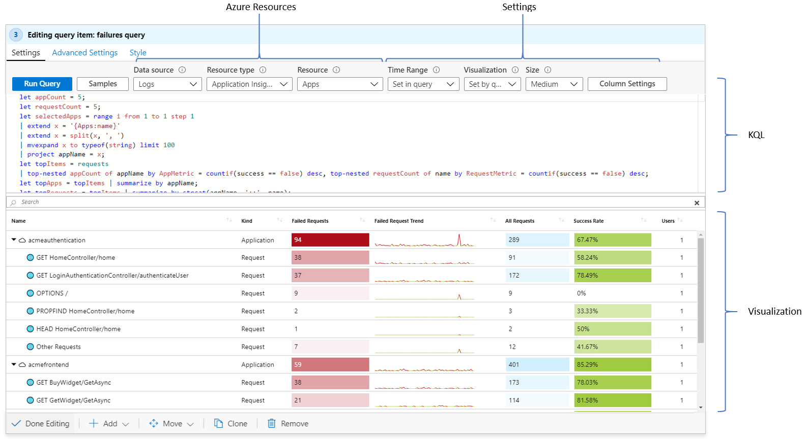
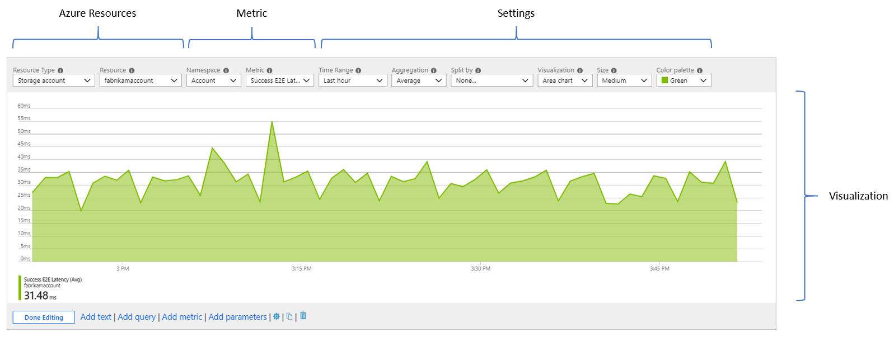
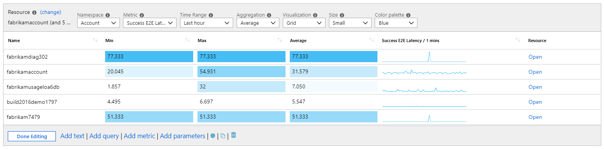
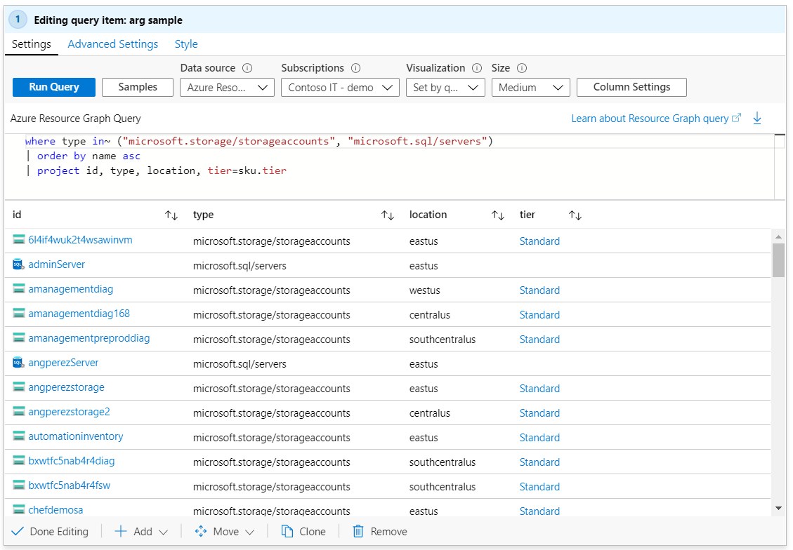
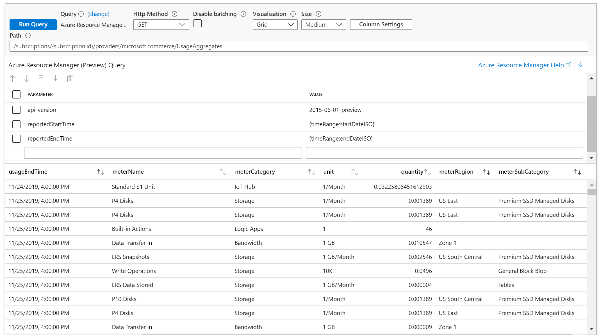
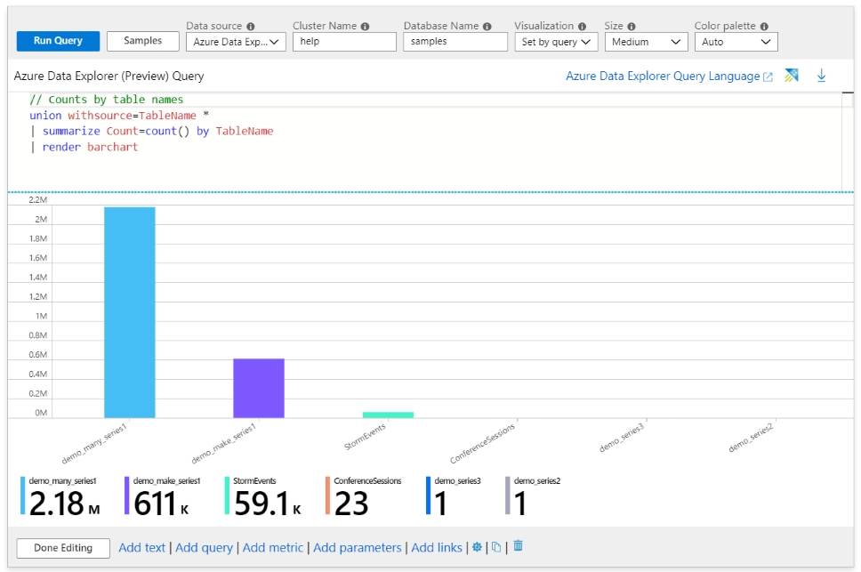
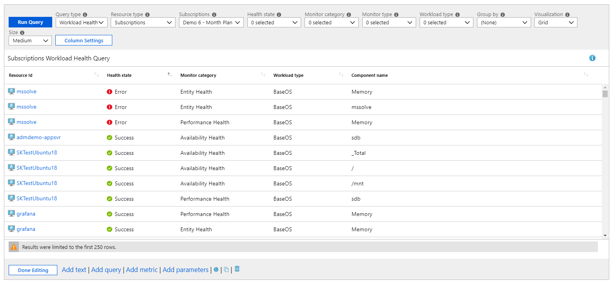
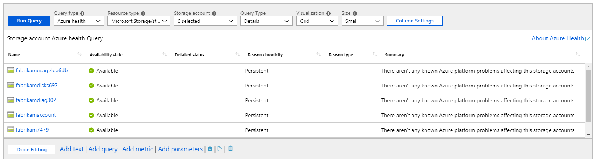

# Data Sources in Workbooks

Workbooks can query data from a lot the common sources of telemetry in Azure. Workbook authors can transform this data in interesting way to provide insights into the availability, performance, usage and success of the underlying components. For instance, they could analyze performance logs from virtual machines to identify high CPU or low memory instances and show the results as a grid in an interactive report. 

Workbooks also allow users to combine data from multiple sources with a single report to allow composite resource views or joins across resources to get richer data.

Workbooks support these data sources:
* [Logs](#logs)
* [Metrics](#metrics)
* [Azure Resource Graph](#azure-resource-graph-arg)
* [Azure Resource Manager](#azure-resource-manager)
* [Azure Data Explorer](#azure-data-explorer)
* [Workload Health](#workload-health)
* [Azure Resource Health](#azure-resource-health)
* [JSON](#json)
* [Alerts](#alerts-preview)
* [Custom Endpoint](#custom-endpoint)
* Custom Provider

You can also use the [Merge](#merge-data-from-different-sources) option in the query control to combine data from different data sources. 

## Logs
Workbooks support querying logs data using the [Kusto Query Language (KQL)](https://docs.microsoft.com/en-us/azure/kusto/query/). Examples of logs include app requests, exceptions, dependencies, traces, etc. in App Insights, or VM perf logs in Log Analytics. Workbooks allow authors to get analytics data using KQL queries and present the insights to users in a visual form.

Workbooks allows querying logs from these sources:
1.	Log Analytics Workspace (LA)
2.	Application Insights Resource (AI)
3.	Resource-centric data (e.g. logs for a VM)

Workbook authors can use KQL queries that transform the underlying resource data to select a result set that can visualized as text, charts or grids. 

Authors can also have their queries target more than one resources to get very powerful unions and joins across components. For instance, you can union virtual machine performance summaries from two different Log Analytics workspaces in a workbook. 

This ability to make arbitrary queries using KQL, along with the visualization and customization capabilities of workbooks provides authors with a powerful toolset for building rich reports and experiences for data analysis. 

[See also: Log Analytics query optimization tips](https://docs.microsoft.com/en-us/azure/azure-monitor/log-query/query-optimization)

[See also: Workbooks best practices and hints for logs queries](LogsBestPracticesAndHints.md)

[Tutorial: Making resource centric log queries in workbooks](ResourceCentricLogs.md)

## Metrics
Azure resources emit metrics that can be accessed via workbooks. Examples of metrics include CPU utilization and disk read rates of VMs, or DTU % of a database. These metrics can be accessed in workbooks via a specialized control that allows you to specify the target resources, interesting metrics and their aggregation. This data can then be plotted in charts or grids. 

## Azure Resource Graph (ARG)
Workbooks supports querying for resources and their metadata using Azure Resource Graph (ARG). This is primarily used to build custom query scopes for reports. The resource scope is expressed via a KQL-subset that ARG supports – which is usually enough the common use cases.

To make a query control use this data source, use the _Data source_ drop down to choose _Azure Resource Graph_ and select the subscriptions to target. Use the _Query_ control to add the ARG KQL-subset that selects an interesting resource subset.

The ARG data source allows querying any of [the tables supported by ARG](https://docs.microsoft.com/en-us/azure/governance/resource-graph/reference/supported-tables-resources).  If the query does not specify a table, the `Resources` table is presumed by the ARG query service.

## Azure Resource Manager
Workbook supports Azure Resource Manager (ARM) REST operations. This allows the ability to query management.azure.com endpoint without the need to provide your own authorization header token.

To make a query control use this data source, use the _Data source_ drop down to choose _Azure Resource Manager_. Provide the appropriate parameters such as Http method, url path, headers, url parameters and/or body.

> **Note**: Only `GET`, `POST`, and `HEAD` operations are currently supported.

[Click here to view a walk-through example of this provider](../Samples/AlertDataARM.md)

This provider supports [JSON Path](../Transformations/JSONPath.md).

## Azure Data Explorer
Workbooks supports querying Azure Data Explorer (ADX).

To make a query control use this data source, use the _Data source_ drop down to choose _Azure Data Explorer_ and enter the ADX cluster and database name.  The database name should be the full https url to the cluster. If the cluster name field is not specified as a url, the value is presumed to be a cluster name, and the https and default suffix will be appended for you. (Note that for most ADX clusters, the host name of the cluster is now the name of the cluster and its azure location, like `examplecluster.westus`). Cluster name and database name support workbook parameters. At the current time, there is no intellisense/completion of table names or column names in the ADX cluster. In order to query the cluster, the current portal user will need read access to that ADX cluster.

> **Note:** only query commands are allowed in workbooks. Control commands (commands starting with a `.`, like `.show`) are not currently permitted in workbooks at this time.

[See also: Azure Data Explorer query best practices](https://docs.microsoft.com/en-us/azure/data-explorer/kusto/query/best-practices)

## Workload Health
Azure Monitor has functionality that proactively monitors the availability and performance of Windows or Linux guest OSes with a model that represent key components and their relationships, criteria that specifies how to measure the health of those components, and which can alert you when an unhealthy condition is detected. Workbooks allow users to use this information to create rich reports.

To make a query control use this data source, use the _Data source_ drop down to choose _Workload Health_ and select subscription, resource group or VM resources to target. Use the health filter drop downs to select an interesting subset of health incidents for your analytic needs.

## Azure Resource Health
Workbooks supports getting Azure resource health and combining it with other data sources to create rich, interactive health reports

To make a query control use this data source, use the _Data source_ drop down to choose _Azure health_ and select the resources to target. Use the health filter drop downs to select an interesting subset of resource issues for your analytic needs.

## Change Analysis (preview)
Workbooks supports [Application Change Analysis](https://docs.microsoft.com/en-us/azure/azure-monitor/app/change-analysis).

To make a query control use this data source, use the _Data source_ drop down to choose _Change Analysis (preview)_ and select a single resource. Changes for up to the last 14 days can be shown. The _Level_ drop down can be used to filter between "Important", "Normal", and "Noisy" changes, and this drop down supports workbook parameters of type [Drop down](../Parameters/DropDown.md).

## Merge data from different sources
It is often necessary to bring together data from different sources that enhance the insights experience. An example is augmenting active alert information with related metric data. This allows users to see not just the effect (an active alert), but also potential causes (e.g. high CPU usage). The monitoring domain has numerous such correlatable data sources that are often critical to the triage and diagnostic workflow. 

Workbooks allow not just the querying of different data sources, but also provides simple controls that allow you to merge or join the data to provide rich insights. The `merge` control is the way to achieve it. 

The example below combines alerting data with log analytics VM performance data where available to get a rich insights grid.

Workbooks support a variety of merge flavors:
* Inner unique join
* Full inner join
* Full outer join
* Left outer join
* Right outer join
* Left semi-join
* Right semi-join
* Left anti-join
* Right anti-join
* Union
* Duplicate table

Here is a tutorial on using the merge control to combine Azure Resource Graph and Log Analytics data:

### Merge examples
[Using the Duplicate Table option to reuse queried data](../Samples/ReusingQueryData.md)

## JSON
The JSON provider allows you to create a query result from static JSON content. It is most commonly used in Parameters to create dropdown parameters of static values. Simple JSON arrays or objects will automatically be converted into grid rows and columns.  For more specific behaviors, you can use the Results tab and JSONPath settings to configure columns.

This provider supports [JSON Path](../Transformations/JSONPath.md).

## Alerts (preview)
> **Note:** The suggested way to query for Azure Alert information is by using the [Azure Resource Graph](#azure-resource-graph) data source, by querying the `AlertsManagementResources` table. 
>
> See [Azure Resource Graph table reference Azure Docs](https://docs.microsoft.com/en-us/azure/governance/resource-graph/reference/supported-tables-resources), or the [Alerts template](../../Workbooks/Azure%20Resources/Alerts/Alerts.workbook) for examples. 
>
> The Alerts data source will remain available for a period of time while authors transition to using ARG. Use of this data source in templates is discouraged. 

Workbooks allow users to visualize the active alerts related to their resources. 
Limitations: the alerts data source requires read access to the Subscription in order to query resources, and may not show newer kinds of alerts. 

To make a query control use this data source, use the _Data source_ drop down to choose _Alerts (preview)_ and select the subscriptions, resource groups or resources to target. Use the alert filter drop downs to select an interesting subset of alerts for your analytic needs.

## Custom endpoint
Workbooks supports getting data from any external source. If your data lives outside Azure you can bring it to Workbooks by using this data source type.

To make a query control use this data source, use the _Data source_ drop down to choose _Custom Endpoint_. Provide the appropriate parameters such as Http method, url, headers, url parameters and/or body. Make sure your data source supports [CORS](https://developer.mozilla.org/en-US/docs/Web/HTTP/CORS) otherwise the request will fail.

To avoid automatically making calls to un-trusted hosts when using templates, the user needs to mark the used hosts as trusted. This can be done by either clicking on the _Add as trusted_ button, or by adding it as a trusted host in Workbook settings. This settings will be saved in browsers that support IndexDb with web workers, more info [here](https://caniuse.com/#feat=indexeddb).

> **Note:** Do not write any secrets in any of the fields (headers, parameters, body, url), since they will be visible to all of the Workbook users.`

This provider supports [JSON Path](../Transformations/JSONPath.md).
