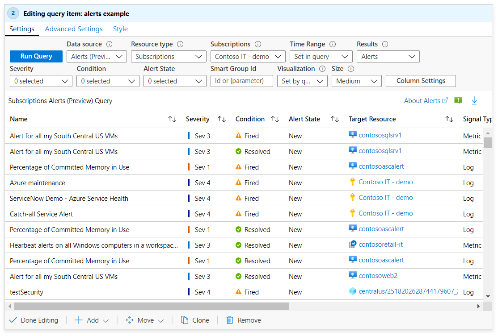

# Data Sources in Workbooks

Workbooks can query data from a lot the common sources of telemetry in Azure. Workbook authors can transform this data in interesting way to provide insights into the availability, performance, usage and success of the underlying components. For instance, they could analyze performance logs from virtual machines to identify high CPU or low memory instances and show the results as a grid in an interactive report. 

Workbooks also allow users to combine data from multiple sources with a single report to allow composite resource views or joins across resources to get richer data.

Workbooks support these data sources:
* [Logs](#logs)
* [Metrics](#metrics)
* [Azure Resource Graph](#azure-resource-graph)
* [Alerts](#alerts)
* [Workload Health](#workload-health)
* [Azure Resource Health](#azure-resource-health)

## Logs
Workbooks support getting analytics logs data. Examples of logs include app requests, exceptions, dependencies, traces, etc. in App Insights, or VM perf logs in Log Analytics. Workbooks allow authors to get analytics data using KQL queries and present the insights to users in a visual form.

Workbooks allows querying logs from these sources:
1.	Log Analytics Workspace (LA)
2.	Application Insights Resource (AI)
3.	Resource-centric data (e.g. logs for a VM)

Workbook authors can use KQL queries that transform the underlying resource data to select a result set that can visualized as text, charts or grids. 

Authors can also have their queries target more than one resources to get very powerful unions and joins across components. For instance, you can union virtual machine performance summaries from two different Log Analytics workspaces in a workbook. 

This ability to make arbitrary queries using KQL, along with the visualization and customization capabilities of workbooks provides authors with a powerful toolset for building rich reports and experiences for data analysis. 

## Metrics
Azure resources emit metrics that can be accessed via workbooks. Examples of metrics include CPU utilization and disk read rates of VMs, or DTU % of a database. These metrics can be accessed in workbooks via a specialized control that allows you to specify the target resources, interesting metrics and their aggregation. This data can then be plotted in charts or grids. 

## Azure Resource Graph (ARG)
Workbooks  support querying for resources and their metadata using Azure Resource Graph (ARG). This is primarily used to build custom query scopes for reports. The resource scope is expressed via a KQL-subset that ARG supports – which is usually enough the common use cases.

To make a query control use this data source, use the _Query Type_ drop down to choose _Azure Resource Graph_ and select the subscriptions to target. Use the _Query_ control to add the ARG KQL-subset that selects an interesting resource subset.

## Alerts
Workbooks allow users to visualize the active alerts related to their resources. This allows the creation of reports that bring together notification data (alert) and diagnostic information (metrics, logs) into one report. This information can also be joined together to create rich reports that combines insights across these data sources. 

To make a query control use this data source, use the _Query Type_ drop down to choose _Alerts_ and select the subscriptions, resource groups or resources to target. Use the alert filter drop downs to select an interesting subset of alerts for your analytic needs.

## Workload Health
Azure Monitor has functionality that proactively monitors the availability and performance of Windows or Linux guest OSes with a model that represent key components and their relationships, criteria that specifies how to measure the health of those components, and which can alert you when an unhealthy condition is detected. Workbooks allow users to use this information to create rich reports.

To make a query control use this data source, use the _Query Type_ drop down to choose _Workload Health_ and select subscription, resource group or VM resources to target. Use the health filter drop downs to select an interesting subset of health incidents for your analytic needs.

## Azure Resource Health
Workbooks supports getting Azure resource health and combining it with other data sources to create rich, interactive health reports

To make a query control use this data source, use the _Query Type_ drop down to choose _Azure health_ and select the resources to target. Use the health filter drop downs to select an interesting subset of resource issues for your analytic needs.

