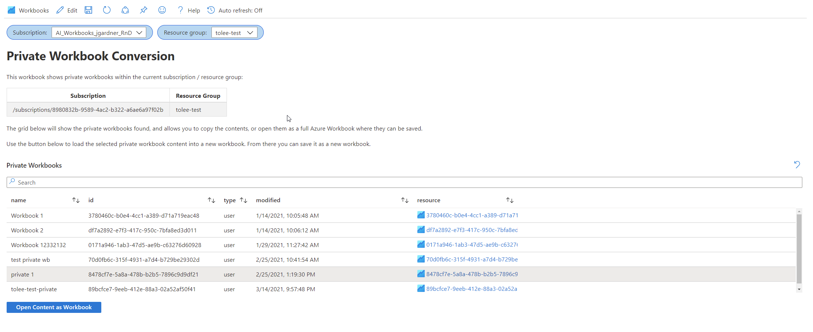

# Deprecated Workbook Retrieval Tool

Private and Legacy workbooks have been deprecated and are unaccessable from the Azure Portal UX. If you are here because you are looking for the deprecated workbook that you forgot to convert before the deadline, you're in luck! We've created a tool that will allow you to retrieve the content of your old workbook and load it into a new workbook so that you can save it as a new workbook.

_To move forward with the deprecation of these workbooks, this tool will only be available for a limited time until **August 31, 2021**._

## Private Workbook Retrieval
1. Open up an new or empty workbook
2. Go into Edit mode in the toolbar and navigate to the advanced editor
    
3. Copy the following workbook json and paste it into your open advanced editor
>{
  "version": "Notebook/1.0",
  "items": [
    {
      "type": 9,
      "content": {
        "version": "KqlParameterItem/1.0",
        "crossComponentResources": [
          "{Subscription}"
        ],
        "parameters": [
          {
            "id": "1f74ed9a-e3ed-498d-bd5b-f68f3836a117",
            "version": "KqlParameterItem/1.0",
            "name": "Subscription",
            "type": 6,
            "isRequired": true,
            "value": "/subscriptions/8980832b-9589-4ac2-b322-a6ae6a97f02b",
            "typeSettings": {
              "additionalResourceOptions": [
                "value::1"
              ],
              "includeAll": false,
              "showDefault": false
            }
          },
          {
            "id": "b616a3a3-4271-4208-b1a9-a92a78efed08",
            "version": "KqlParameterItem/1.0",
            "name": "ResourceGroup",
            "label": "Resource group",
            "type": 2,
            "isRequired": true,
            "query": "Resources\r\n| summarize by resourceGroup\r\n| order by resourceGroup asc\r\n| project id=resourceGroup, resourceGroup",
            "crossComponentResources": [
              "{Subscription}"
            ],
            "value": "tolee-test",
            "typeSettings": {
              "additionalResourceOptions": [
                "value::1"
              ],
              "showDefault": false
            },
            "queryType": 1,
            "resourceType": "microsoft.resourcegraph/resources"
          }
        ],
        "style": "pills",
        "queryType": 1,
        "resourceType": "microsoft.resourcegraph/resources"
      },
      "name": "resource selection"
    },
    {
      "type": 1,
      "content": {
        "json": "# Private Workbook Conversion\r\n\r\nThis workbook shows private workbooks within the current subscription / resource group: \r\n\r\n| Subscription | Resource Group | \r\n|--------------|----------------|\r\n|{Subscription}|{ResourceGroup} |\r\n\r\nThe grid below will show the private workbooks found, and allows you to copy the contents, or open them as a full Azure Workbook where they can be saved.\r\n\r\nUse the button below to load the selected private workbook content into a new workbook. From there you can save it as a new workbook."
      },
      "name": "text - 5"
    },
    {
      "type": 3,
      "content": {
        "version": "KqlItem/1.0",
        "query": "{\"version\":\"ARMEndpoint/1.0\",\"data\":null,\"headers\":[],\"method\":\"GETARRAY\",\"path\":\"/{Subscription}/resourceGroups/{ResourceGroup}/providers/microsoft.insights/myworkbooks\",\"urlParams\":[{\"key\":\"api-version\",\"value\":\"2020-10-20\"}],\"batchDisabled\":false,\"transformers\":[{\"type\":\"jsonpath\",\"settings\":{\"tablePath\":\"$..[?(@.kind == \\\"user\\\")]\",\"columns\":[{\"path\":\"$.properties.displayName\",\"columnid\":\"name\"},{\"path\":\"$.name\",\"columnid\":\"id\"},{\"path\":\"$.kind\",\"columnid\":\"type\",\"columnType\":\"string\"},{\"path\":\"$.properties.timeModified\",\"columnid\":\"modified\",\"columnType\":\"datetime\"},{\"path\":\"$.id\",\"columnid\":\"resource\",\"columnType\":\"string\"}]}}]}",
        "size": 1,
        "title": "Private Workbooks",
        "noDataMessage": "No private workbooks found",
        "noDataMessageStyle": 3,
        "exportedParameters": [
          {
            "fieldName": "id",
            "parameterName": "id"
          },
          {
            "fieldName": "name",
            "parameterName": "name",
            "parameterType": 1
          },
          {
            "fieldName": "resource",
            "parameterName": "resource",
            "parameterType": 1
          }
        ],
        "queryType": 12,
        "gridSettings": {
          "formatters": [
            {
              "columnMatch": "resource",
              "formatter": 5
            }
          ],
          "rowLimit": 1000,
          "filter": true,
          "sortBy": [
            {
              "itemKey": "modified",
              "sortOrder": 1
            }
          ]
        },
        "sortBy": [
          {
            "itemKey": "modified",
            "sortOrder": 1
          }
        ]
      },
      "name": "list private workbooks"
    },
    {
      "type": 9,
      "content": {
        "version": "KqlParameterItem/1.0",
        "parameters": [
          {
            "id": "8d78556d-a4f3-4868-bf06-9e0980246d31",
            "version": "KqlParameterItem/1.0",
            "name": "config",
            "type": 1,
            "query": "{\"version\":\"ARMEndpoint/1.0\",\"data\":null,\"headers\":[],\"method\":\"GET\",\"path\":\"{Subscription}/resourceGroups/{ResourceGroup}/providers/microsoft.insights/myworkbooks/{id}\",\"urlParams\":[{\"key\":\"api-version\",\"value\":\"2020-10-20\"},{\"key\":\"sourceType\",\"value\":\"notebook\"},{\"key\":\"canFetchContent\",\"value\":\"true\"}],\"batchDisabled\":false,\"transformers\":[{\"type\":\"jsonpath\",\"settings\":{\"columns\":[{\"path\":\"$..serializedData\",\"columnid\":\"Content\"}]}}]}",
            "timeContext": {
              "durationMs": 86400000
            },
            "queryType": 12
          }
        ],
        "style": "pills",
        "queryType": 12
      },
      "conditionalVisibility": {
        "parameterName": "debug",
        "comparison": "isNotEqualTo"
      },
      "name": "turn response into param"
    },
    {
      "type": 11,
      "content": {
        "version": "LinkItem/1.0",
        "style": "list",
        "links": [
          {
            "id": "fc93ee9e-d5b2-41de-b74a-1fb62f0df49e",
            "linkTarget": "OpenBlade",
            "linkLabel": "Open Content as Workbook",
            "style": "primary",
            "bladeOpenContext": {
              "bladeName": "UsageNotebookBlade",
              "extensionName": "AppInsightsExtension",
              "bladeParameters": [
                {
                  "name": "ComponentId",
                  "source": "parameter",
                  "value": "resource"
                },
                {
                  "name": "NewNotebookData",
                  "source": "parameter",
                  "value": "config"
                }
              ]
            }
          }
        ]
      },
      "conditionalVisibility": {
        "parameterName": "config",
        "comparison": "isNotEqualTo"
      },
      "name": "links - 4"
    }
  ],
  "fallbackResourceIds": [
    "/subscriptions/8980832b-9589-4ac2-b322-a6ae6a97f02b/resourceGroups/tolee-test/providers/Microsoft.OperationalInsights/workspaces/tolee-test-ws"
  ],
  "$schema": "https://github.com/Microsoft/Application-Insights-Workbooks/blob/master/schema/workbook.json"
}

4. Click Apply at the top right
5. Select the subscription and resource group of the workbook you'd like to retrieve the workbook from
6. The grid at the bottom of this workbook will list all the private workbooks in the selected subscription / resource group above.
7. Click on one of the workbooks in the grid. Your workbook should look something like this:
    > 
8. Click the button at the bottom of the workbook labeled "Open Content as Workbook"
9. A new workbook will open with the exact content of the old private workbook that you selected. You can now treat this like any new workbook.

## Favorites Based (Legacy) Workbook Retrieval
1. Navigate to your Application Insights Resource > Workbooks gallery
2. Open up an new or empty workbook
3. Click Edit in the toolbar and navigate to the advanced editor
    
4. Copy the following workbook json and paste it into your open advanced editor
>{
  "version": "Notebook/1.0",
  "items": [
    {
      "type": 9,
      "content": {
        "version": "KqlParameterItem/1.0",
        "parameters": [
          {
            "id": "876235fc-ef67-418d-87f5-69f496be171b",
            "version": "KqlParameterItem/1.0",
            "name": "resource",
            "type": 5,
            "typeSettings": {
              "additionalResourceOptions": [
                "value::1"
              ],
              "componentIdOnly": true
            },
            "timeContext": {
              "durationMs": 86400000
            },
            "defaultValue": "value::1"
          }
        ],
        "style": "pills",
        "queryType": 0,
        "resourceType": "microsoft.insights/components"
      },
      "conditionalVisibility": {
        "parameterName": "debug",
        "comparison": "isNotEqualTo"
      },
      "name": "resource selection"
    },
    {
      "type": 1,
      "content": {
        "json": "# Legacy (Favorites based) Workbook Conversion\r\n\r\nThis workbook shows favorite based (legacy) workbooks in this Application Insights resource: \r\n\r\n{resource:grid}\r\n\r\nThe grid below will show the favorite workbooks found, and allows you to copy the contents, or open them as a full Azure Workbook where they can be saved."
      },
      "name": "text - 5"
    },
    {
      "type": 3,
      "content": {
        "version": "KqlItem/1.0",
        "query": "{\"version\":\"ARMEndpoint/1.0\",\"data\":null,\"headers\":[],\"method\":\"GETARRAY\",\"path\":\"{resource}/favorites\",\"urlParams\":[{\"key\":\"api-version\",\"value\":\"2015-05-01\"},{\"key\":\"sourceType\",\"value\":\"notebook\"},{\"key\":\"canFetchContent\",\"value\":\"false\"}],\"batchDisabled\":false,\"transformers\":[{\"type\":\"jsonpath\",\"settings\":{\"columns\":[{\"path\":\"$.Name\",\"columnid\":\"name\"},{\"path\":\"$.FavoriteId\",\"columnid\":\"id\"},{\"path\":\"$.TimeModified\",\"columnid\":\"modified\",\"columnType\":\"datetime\"},{\"path\":\"$.FavoriteType\",\"columnid\":\"type\"}]}}]}",
        "size": 0,
        "title": "Legacy Workbooks (Select an item to see contents)",
        "noDataMessage": "No legacy workbooks found",
        "noDataMessageStyle": 3,
        "exportedParameters": [
          {
            "fieldName": "id",
            "parameterName": "favoriteId"
          },
          {
            "fieldName": "name",
            "parameterName": "name",
            "parameterType": 1
          }
        ],
        "queryType": 12,
        "gridSettings": {
          "rowLimit": 1000,
          "filter": true
        }
      },
      "name": "list favorites"
    },
    {
      "type": 9,
      "content": {
        "version": "KqlParameterItem/1.0",
        "parameters": [
          {
            "id": "8d78556d-a4f3-4868-bf06-9e0980246d31",
            "version": "KqlParameterItem/1.0",
            "name": "config",
            "type": 1,
            "query": "{\"version\":\"ARMEndpoint/1.0\",\"data\":null,\"headers\":[],\"method\":\"GET\",\"path\":\"{resource}/favorites/{favoriteId}\",\"urlParams\":[{\"key\":\"api-version\",\"value\":\"2015-05-01\"},{\"key\":\"sourceType\",\"value\":\"notebook\"},{\"key\":\"canFetchContent\",\"value\":\"true\"}],\"batchDisabled\":false,\"transformers\":[{\"type\":\"jsonpath\",\"settings\":{\"columns\":[{\"path\":\"$.Config\",\"columnid\":\"Content\"}]}}]}",
            "timeContext": {
              "durationMs": 86400000
            },
            "queryType": 12
          }
        ],
        "style": "pills",
        "queryType": 12
      },
      "conditionalVisibility": {
        "parameterName": "debug",
        "comparison": "isNotEqualTo"
      },
      "name": "turn response into param"
    },
    {
      "type": 11,
      "content": {
        "version": "LinkItem/1.0",
        "style": "list",
        "links": [
          {
            "id": "fc93ee9e-d5b2-41de-b74a-1fb62f0df49e",
            "linkTarget": "OpenBlade",
            "linkLabel": "Open Content as Workbook",
            "style": "primary",
            "bladeOpenContext": {
              "bladeName": "UsageNotebookBlade",
              "extensionName": "AppInsightsExtension",
              "bladeParameters": [
                {
                  "name": "ComponentId",
                  "source": "parameter",
                  "value": "resource"
                },
                {
                  "name": "NewNotebookData",
                  "source": "parameter",
                  "value": "config"
                }
              ]
            }
          }
        ]
      },
      "conditionalVisibility": {
        "parameterName": "config",
        "comparison": "isNotEqualTo"
      },
      "name": "links - 4"
    }
  ],
  "fallbackResourceIds": [
    "/subscriptions/ad825170-845c-47db-8f00-11978947b089/resourceGroups/IbizaAIExtension/providers/microsoft.insights/components/insightsportal-dev"
  ],
  "$schema": "https://github.com/Microsoft/Application-Insights-Workbooks/blob/master/schema/workbook.json"
}

5. Click Apply at the top right
6. The grid at the bottom of this workbook will list all the legacy workbooks within the current AppInsights resource.
7. Click on one of the workbooks in the grid. Your workbook should now look something like this:
    > 
8. Click the button at the bottom of the workbook labeled "Open Content as Workbook"
9. A new workbook will open with the exact content of the old private workbook that you selected. You can now treat this like any new workbook.