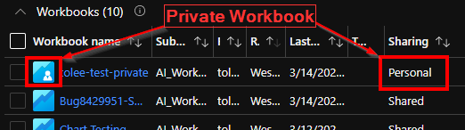
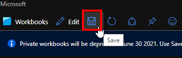
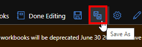
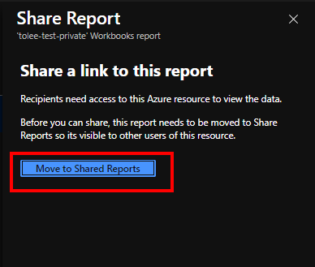
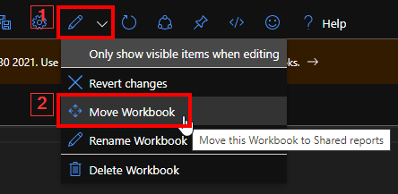

> [!NOTE] 
> This documentation for Azure workbooks is now located at: https://learn.microsoft.com/en-us/azure/azure-monitor/visualize/workbooks-retrieve-legacy-workbooks
> Please **do not** edit this file. All up-to-date information is in the new location and documentation should only be updated there.

# Private Workbooks Deprecation
Workbooks were available in two modes – private and shared. Private workbooks were accessible only to the author and was the default save mode.  

Private Workbooks were stored as a different Azure resource type than Shared Workbooks. We are merging these different Azure resource types and making one single standard type. This will allow it to take advantage of all the existing and new functionality available in Azure Workbooks. This includes 

- Shared Workbooks can be queried via Azure Resource Graph (ARG) 
- Shared Workbooks can support top level ARM features like other resource types, including but not limited to 
    - Tags 
    - Activity Log / Change Tracking 
    - Resource locks 
- Shared Workbooks can support ARM templates  
- Shared workbooks are searchable in browse blade  
- Shared Workbooks can support "Bring your own storage" (BYOS) feature 
- Shared Workbooks can be saved in region of your choice 

Private workbooks will be deprecated by **June 30, 2021** to simplify the consumption and sharing experience. There are two stages to private workbook deprecation.  

1. First stage - Switch default save mode for workbooks to shared 
    - Every new workbook is **now** saved as shared workbook by default. 
    - We have removed the ability to create/ update private workbooks. 
 
2. Second stage - Convert existing private workbooks to shared workbooks  
    - <ins>**You**</ins> will need to convert your existing private workbooks to shared workbooks by
        - Either using 'save' / 'save as' (make a copy)  
        - Or using 'copy link' / 'move workbook' (in place) 
    - After **June 30, 2021** your private workbooks will not be available, so it is important to convert them to continue to use them. 

# How should you proceed? 

### Identify Private Workbooks 

You can identify private workbooks and shared workbooks by  

1. the icon in gallery
2. the share type as shown in the Sharing column in gallery 

    

### Convert Private Workbooks to Shared workbooks 
If you choose to convert your private workbook to a shared one, you can do so by opening the workbook and using one of the following methods.  

_**Note** – This conversion will not change the content of your workbook or where you find your workbook._

- **Save (same as save as)** - This will require you to select a subscription, resource group, and region where you have write access.  It will create a new copy and you may want to change references (pinned to dashboard or used in another workbook)  

- **Save As (in edit mode)** - This will require you to select a subscription, resource group, and region where you have write access. It will create a new copy and you may want to change references (pinned to dashboard or used in another workbook)  

- **Copy Link > "Move to Shared Reports"** – This will work only if you have write access to subscription, resource group, and region. It changes this workbook and all references are maintained  

    
    

- **Move Workbook** – This will work only if you have write access to subscription, resource group, and region. It changes this workbook and all references are maintained      

    
### Things to remember 

1. Any **new** workbook you create will be Shared workbook. 
2. Any **existing shared** workbook is not affected.  
3. Any **existing private** workbook 
    - You can access it until **Jun 30, 2021** in Azure portal.  
    - Any save will create a copy (Shared workbook) as noted above.  

### Managing Test Workbook Clutter 

The simplest way to keep things separate is to save test workbooks to a different subscription and/or resource group. You can filter to specific subscription and resource group in the gallery to locate your workbook  

Learn more about Workbook Access control here: https://docs.microsoft.com/en-us/azure/azure-monitor/visualize/workbooks-access-control 

# What happens if I don't Convert? 

If you do not convert your private workbook to shared it will not be directly accessible from the Workbooks tools in the Azure Portal after **July 2021**. 

# Workbook Conversion Tool

If you need weren't able to convert your private workbook before the deprecation date, you can migrate its content to a new workbook by following the steps here: [Workbooks Conversion Tool](../LegacyAI/DeprecatedWorkbookRetrievalTool.md)