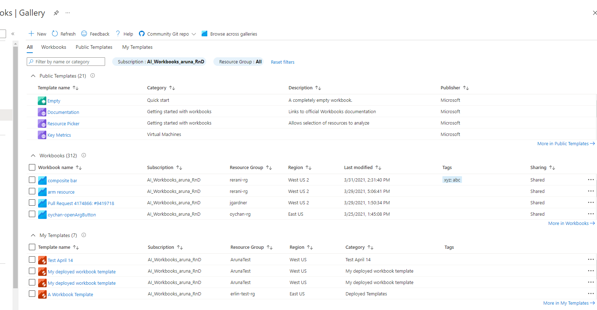
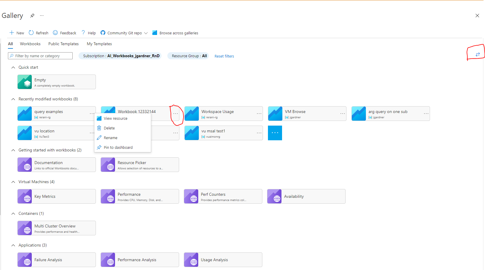
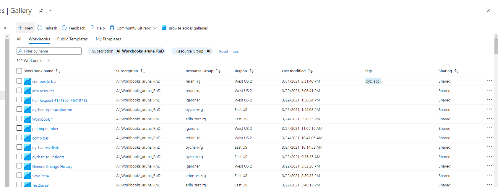
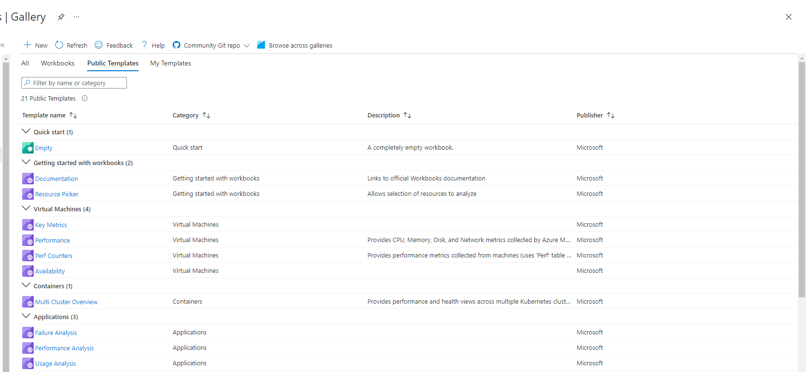
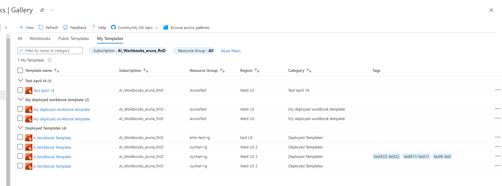
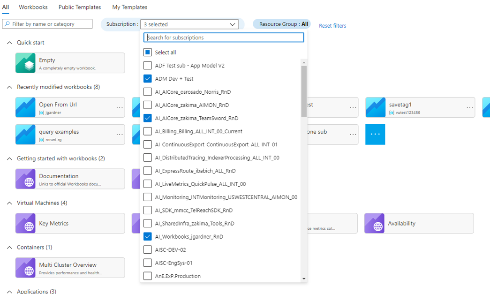
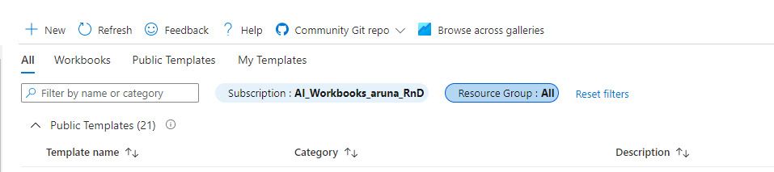
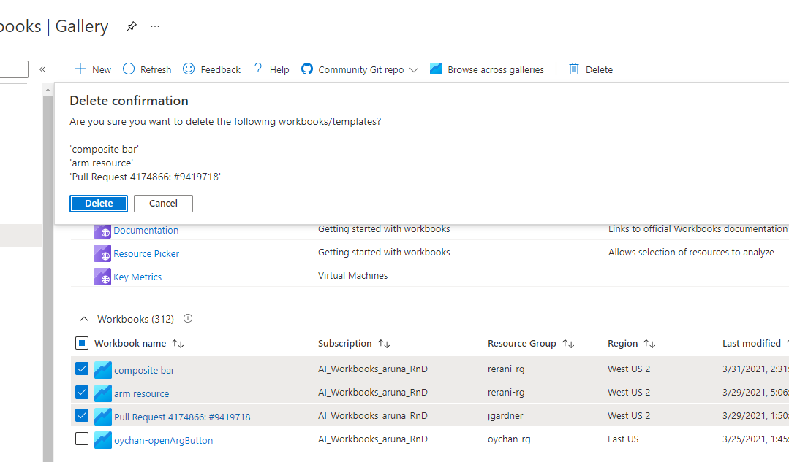
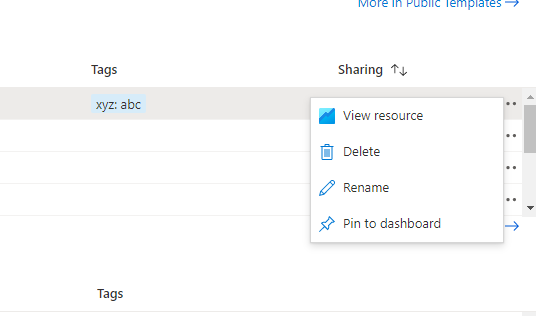
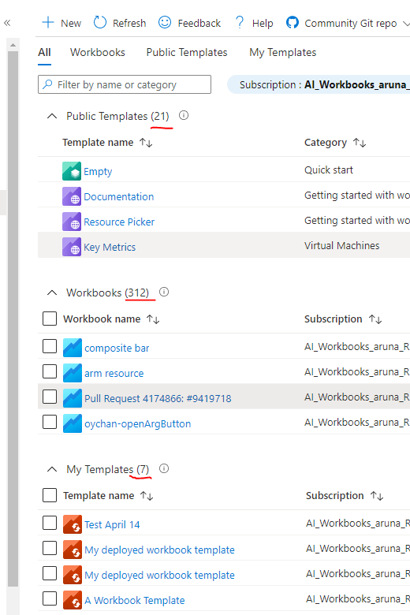

> [!NOTE] 
> This documentation for Azure workbooks is now located at: https://learn.microsoft.com/en-us/azure/azure-monitor/visualize/workbooks-overview#the-gallery.
> Please **do not** edit this file. All up-to-date information is in the new location and documentation should only be updated there.

## New Gallery for Workbooks

Here is the new gallery for the workbooks.

The gallery has 4 tabs:.
* All: It shows all the items for each type – Workbooks, Public Templates, and My Templates. Workbooks are sorted by modified date. Public Templates and My Templates are sorted based on order property. All tab has the card view as default view. There is a switch layout button to switch between card and list view.

* Workbooks: It shows the list of all the available workbooks

* Public Templates: The list of all the available community templates grouped by category

* My Templates: The list of all the available deployed workbook templates grouped by category

### What's cool in new gallery
1. The gallery has clear segment division -> There are different sections for Workbooks, Public Templates, and My Templates.
2. The gallery shows a lot more metadata compared to what we had in old gallery. ex. tags, description, resource groups, region, etc.
3. The user can see all items in gallery without clicking on the 'Open' button that we had in old gallery
4. The columns in grids are sortable. So user can sort the rows say by last modified time, name, category etc.
5. User can filter based on multiple subscriptions and resource groups. The user can view Workbooks under multiple subscriptions and resource groups on single page.

6. Earlier user could only filter by name or subscriptions. In new gallery, user can filter by Workbook/template name or template category, subscriptions and resource groups.

6. Bulk delete is available in gallery. User can also delete templates and workbooks together.

7. Each Workbooks and My Templates row has a context menu(three dots at the end) clicking on which opens a list of quick actions.

8. Each shared Workbook has a 'View Resource' quick action which will open it as an ARM Resource.

9. User can see the count of all the items that are available under current subscription.

