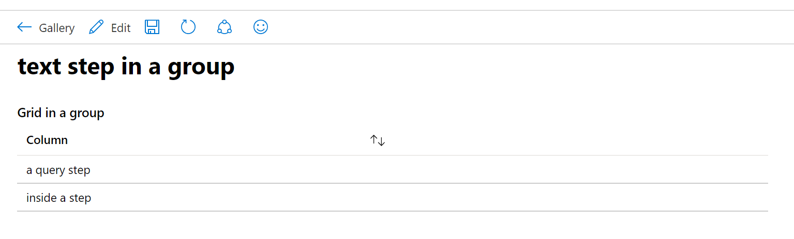
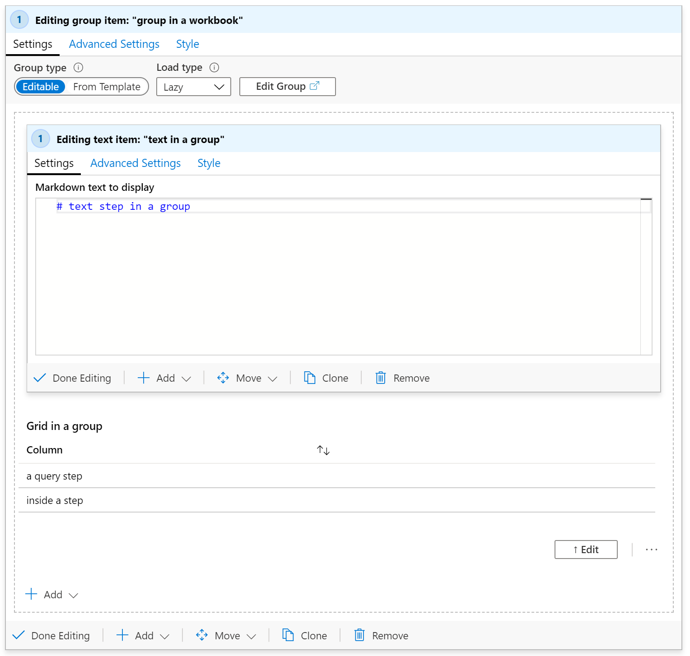
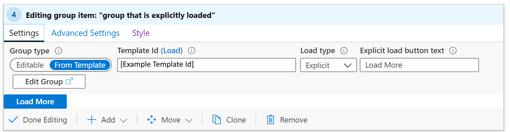
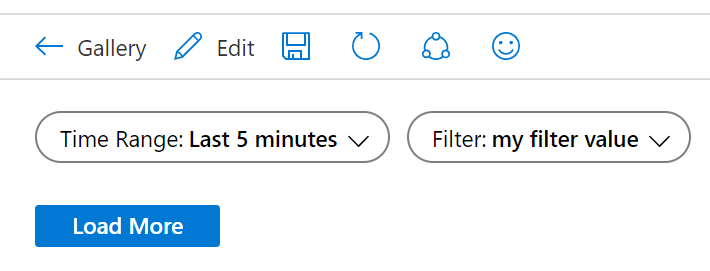
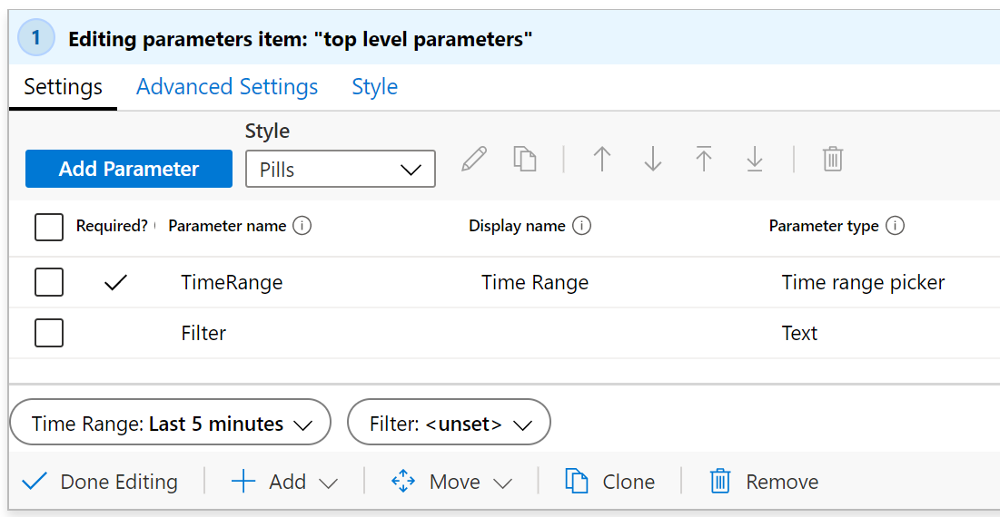
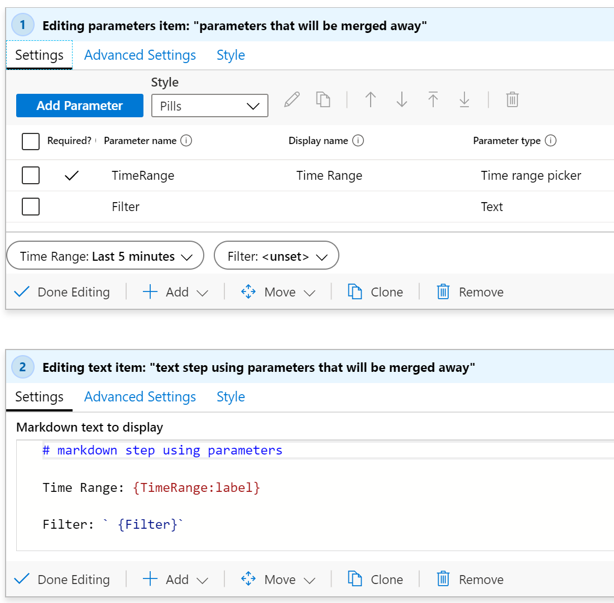
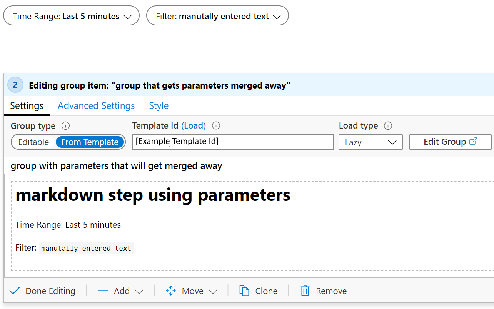
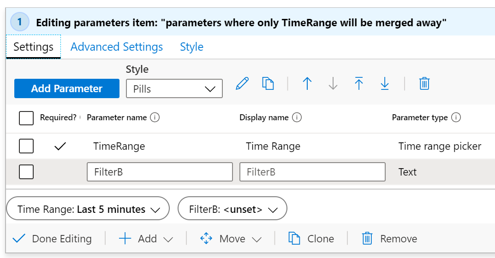
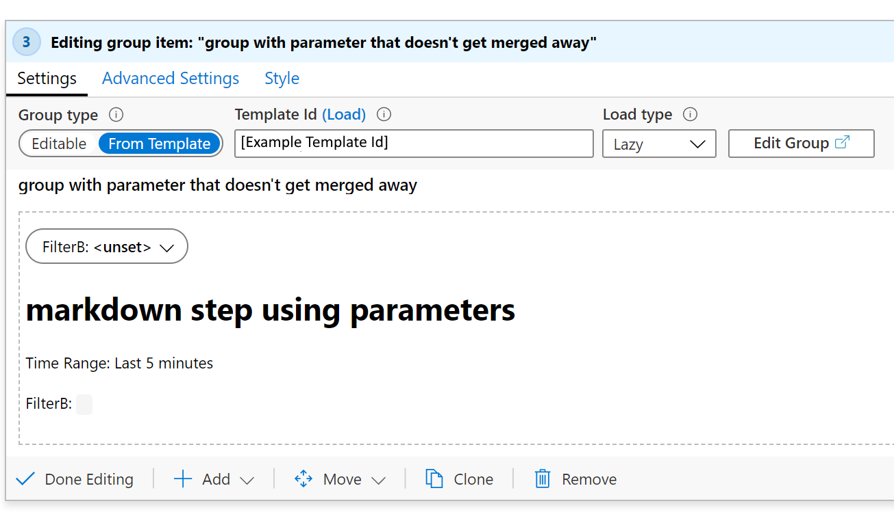

# Using Groups

A group item in a workbook allows you to logically group a set of steps in a workbook. In reading mode, the group itself has no "chrome", only showing the items that are inside the group:

When editing the workbook, you can see those 2 items are actually inside a group item:

In the screenshot above, the group ("group in a workbook") is in edit mode being edited, showing it contains 2 items (inside the dashed area), and the text step inside the group ("text in a group") is also being edited. a query step appears below the text step in the group 

Groups in workbooks are useful for several things:

1. layout - in scenarios where you want items to "stack up" vertically, you can create a group of items that will all stack up, and set the styling of the *group* to be a percentage width, instead of setting percentage width on all the individual items.

2. visibility - in scenarios where you want many items to hide/show together, you can set the visibility of the entire group of items, instead of setting visibility settings on each individual item. This can be very useful in templates that use tabs, as you can use a group as the content of the tab, and the entire group can be hidden/shown based on a parameter set by the selected tab.

3. performance - in cases where you have a very large templates with many sections or tabs, you can convert each section into it's own sub-template and use groups to load all the sub-templates within the top level template. In these cases, the contents of the sub-templates won't load or run until a user makes those groups visible. See [How to split a large template into many templates](#how-to-split-a-large-template-into-many-templates) for more information.

## Scoping
Note: at the current time, a group is treated as a new "scope" in the workbook. Any parameters created in the group are only visible *inside the group*. This is also true for things like merge, they can only see data inside their group or at the parent level.

## Group types
The workbook "group" item allows you to add a group of items to a workbook. As the author of a workbook, you specify which type of group it will be. There are 2 types of groups:

* **editable** - the group in the workbook allows you to add/remove/edit the contents of the items in the group. this is most commonly used for layout and visibility purposes.

* **from template** - the group in the workbook loads from the contents of another template by its id. the content of that template is loaded and merged into the workbook at runtime. In edit mode, you cannot modify any of the contents of the group, as they will just load again from the template next time the item loads.

## Load types
There are several different ways that the content of a group may be loaded. As the author of a workbook, you get to specify when and how the contents of the group will load

* **lazy** (the default) - the group will only load when the item is visible. this allows a group to be used by tab items, and if the tab is never selected, the group never becomes visible, so the content isn't loaded. 
    - For groups created from a template, the content of the template is not retrieved and the items in the group are not created until the group becomes visible. the user will see progress spinners for the whole group while the content is retrieved.
    - for editable groups, the content is loaded, but the items that would be displayed in the group are not created until the item becomes visible

* **explicit** - in this mode, a button is displayed where the group would be, and no content is retrieved or created until the user explicitly clicks the button to load the content. This is useful in "show more" scenarios, where the content might be expensive to compute or rarely used. The author can specify the text to appear on the button.

    ##### explicit load settings, showing a configured "Load more" button :

    

    ##### the group before being loaded in the workbook:

    

    ##### the group after being loaded in the workbook:

    

* **always** - in this mode, the content of the group is always loaded and created as soon as the workbook loads. This mode is most freqently used when using a group only for layout purposes, where the content will always be visible.

## Using templates inside a group
When a group is configured to load from a template, that content will be loaded "lazily" by default, in that it will only load when the group is visible.

When a template is loaded into a group, the workbook attempts to "merge" any parameters declared in the template being loaded with parameters already existing in the group. Any parameters that already exist in the workbook with identical names will be "merged out" of the template being loaded (and if all parameters in a parameters step are merged out, the entire paramters step will disappear)

#### Example 1: consider a template that has 2 parameters at the top:

1. `TimeRange` - a time range parameter
2. `Filter` - a text parameter

then a Group item loads a template that itself has 2 parameters and a text step, where the parameters are named the same in the second template:

When the second template is loaded into the group. the duplicate parameters will be merged away, and because all of the parameters are merged away, the inner parameters step is also merged away, resulting in the group containing *only* the text step:

#### Example 2: consider a group's template that has 2 parameters at the top:

1. `TimeRange` - a time range parameter
2. `FilterB` - a text parameter, note it is not `Filter` like the top template had.

when the group item's template is loaded, the `TimeRange` parameter will be merged out of the group, and you'll have a workbook that has a the initial parameters step with `TimeRange` and `Filter`, and the group's parameter step will only include `FilterB`, and the text step.

If the loaded template had contained `TimeRange` and `Filter` (instead of `FilterB`), then the resulting workbook would have a param step, and a group with only the text step remaining.

# How to split a large template into many templates

For performance reasons, it is beneficial to break up a large template into many smaller templates that load some content lazily or on demand by the user. This makes the initial load faster, as the top level template can be much smaller.

When splitting a template into parts, you'll effectively need to split the template into many templates (calling them "sub-templates" for the rest of this document) that all work individually. So if the top level template has a `TimeRange` parameter that other steps use, the sub-templates need to also have a parameters step that defines a parameter with that exact name. This lets the sub-templates work independently as their own 100% functional templates, and lets them be loaded inside larger templates in groups.

The simplest way to do this is to:
1. create a new empty group near the top of the workbook, after the shared parameters. this new group will eventually become a sub-template
2. create a copy of the shared parameters step, and then use "move into group" to move the copy into the group created in step 1. this parameters step will allow the sub-template to work independently of the outer template, and will get "merged out" when loaded inside the outer template.
(*technically*, the sub-templates don't *need* to have these parameters that get merged away, if you *never* intend on the sub-templates being visible by themselves, so you could remove them. But it will make them very hard to edit or debug if you ever need to edit them later!)
3. move each item in the workbook you want to be in the sub-template into the group created in step 1.
4. if the individual steps moved in step 3 had conditional visibilities that will become the visibility of the outer group (like used in tabs), remove them from the items inside the group, and add that visibility setting to the group itself. Save here to avoid losing changes, and/or export and save a copy of the json content.
5. **If you want that group to be loaded from a template**, you can use the `Edit` toolbar button in the group, which will open *just the contents of that group* as a workbook in a new window. You can then save it as appropriate and close this workbook view (don't close the browser, just that view, to go back to the previous workbook you were editing.).
6. you can then change the group step to load from template, and set the template id field to the workbook/template you created in step 5. (To work with workbook ids, the source needs to be a shared workbook resource id). Press `Load`, and the content of that group will now be loaded from that sub-template instead of saved inside this outer workbook.

