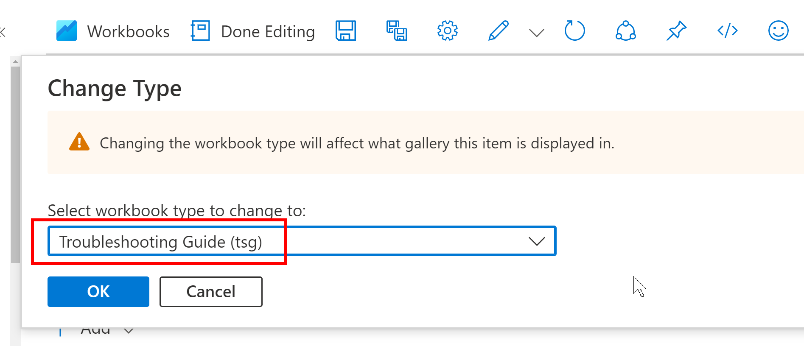
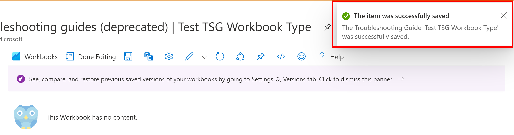
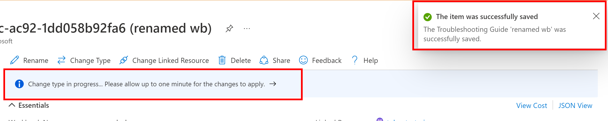

# Deprecated Troubleshooting Guides Retrieval

Troubleshooting guides are deprecated. The "Troubleshooting Guides" menu item is going away, but You'll continue to have access to them via the Workbooks browse blade. If you want to move your workbooks from the Troubleshooting Guide gallery to the Workbook gallery, we've added a function to allow users to change workbook types to any of the possible types.

# Change Workbook Type Methods
    
## Inside the workbook
1. open up a workbook and enter edit mode (if not already in edit mode) by clicking the 'Edit' button in the toolbar. Then click the 'More editing options' button to find the new 'Change Type' button.

2. A window will pop up with a dropdown with a list of possible workbook types to change to. Select the type and click 'OK'. Notice that the dropdown has the current workbook type pre-selected.

3. Upon successful type change, you'll see a success status popup in the top right corner. It may take up to a minute for the change to be reflected in the gallery.

4. Notice that the workbook that was previously a 'Troubleshooting Guide' type that only resided in the Troubleshooting Guides gallery can now be accessed in the Workbooks gallery.

## Workbook resource blade
1. Open up the workbooks browse blade and select the workbook that you want to change by clicking on the workbook name

2. Notice the current workbook type is labeled as "tsg"

3. Upon successful type change, a box will pop up in the top corner and a banner will pop up saying that it may take up to one minute ofr the change to be reflected.

## Gallery card item '...' menu
1. Navigate to the gallery contianing the workbook that you'd like to change the type for. Click the "..." button on the gallery card item and click the "Change Type" button in the resulting menu.

# Accessing/finding a workbook
The Workbooks Browse blade does not care about type and will show you a list of all your workbooks.

