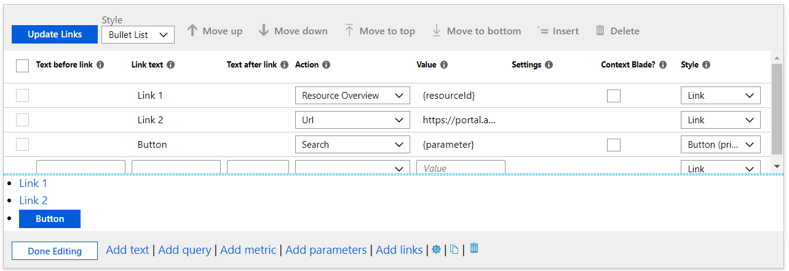
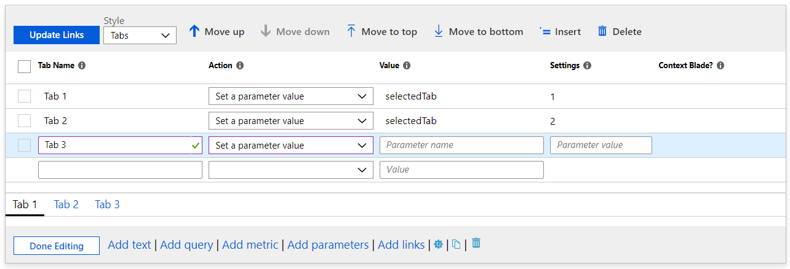
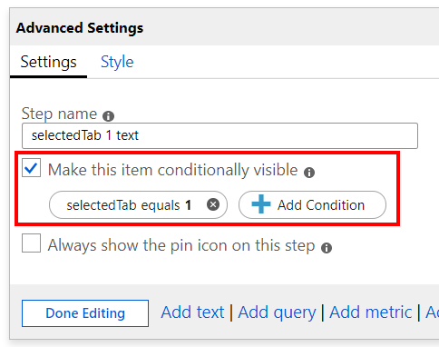

# Using Links Steps

Authors can use the `Links` step to create links to other views, to other workbooks, to other steps inside a workbook, or to create tabbed views within a workbook. Much of the configuration for links is very similar to [using links inside of grids/other visualizations](../Visualizations/Grid.md#link-actions). The links can be styled as hyperlinks, buttons, and tabs.  

## Styling
Styling can be applied to the links step itself, and the style of individual links.

### Step styling

| Style | Sample | Notes |
|:------------- |:-------------|:-------------|
| `Bullet List` |  | The default - links will appear as a bulleted list of links, one on each line.  The `Text before link` and `Text after link` fields can be used to add additional text before or after the link items |
| `List` |   | Links will appear as a list of links, with no bullets |
| `Paragraph` |  | Links will appear as a paragraph of links, wrapped like a paragraph of text |
| `Navigation` |  | Links will appear as links, with vertical `|` dividers between each link |
| `Tabs` |  | Links appear as tabs.  Each link will appear as a tab, no link styling options apply to individual links.  See the [tabs](#Using-Tabs) section below for how to configure tabs |

### Link styling
| Style | Description |
|:------------- |:-------------|
| `Link` | The default - links will appear as a hyperlink.  Url links can only be link style.  |
| `Button (Primary)` | the link will appear as a "primary" button in the portal, usually a blue color |
| `Button (Secondary)` | the links will appears as a "secondary" button in the portal, usually a "transparent" color, a white button in light themes and a dark gray button in dark themes.  |

### Link Actions
Links in the link step can use all of the link actions available in [grids and other visualizations](./LinkActions.md), and have 2 more available actions:

| Action | Description |
|:------------- |:-------------|
| `Set a parameter value` | When clicking a link/button/tab, a parameter can be set to a value. Commonly tabs are configured to set a parameter to a value, which hides and shows other parts of the workbook based on that value  |
| `Scroll to a step` | When clicking a link, the workbook will move focus and scroll to make another step visible. This action can be use to create a "table of contents", or a "go back to the top" style experience.   |

# Using Tabs

Most of the time, tab links will be combined with the `Set a parameter value` action. Here's an example showing the links step configured to create 2 tabs, where clicking on either tab will set a parameter `selectedTab` to a different value (the example shows a 3rd tab being edited to show the parameter name and parameter value placeholders):

You can then add other steps in the workbook that are conditionally visible if the `selectedTab` parameter value is "1" by using the advanced settings:

When using tabs, the first tab will be selected by default, initially setting `selectedTab` to 1, and making that step visible. Selecting the second tab will change the value of the parameter to "2", and different content will be displayed:

A full example of the above tabs is available as [LinkSample.workbook](LinkSample.workbook)

### Tabs limitations:
* When using tabs, Url links are not supported. a Url link in a tab will appear as a disabled tab.
* When using tabs, no item styling is available. Items will only be displayed as tabs, and only the tab name (link text) field will be displayed. Fields that are not used in tab style are hidden while in edit mode.
* When using tabs, the first tab will become selected by default, invoking whatever action that tab has specified. If the first tab's action opens another view, that means as soon as the tabs are created, a view will appear.
* While having tabs open other views is *supported*, it should be used sparingly, as most users won't expect clicking a tab to navigate. (Also, if other tabs are setting parameter to a specific value, a tab that opens a view would not change that value, so the rest of the workbook content will continue to show the view/data for the previous tab.)