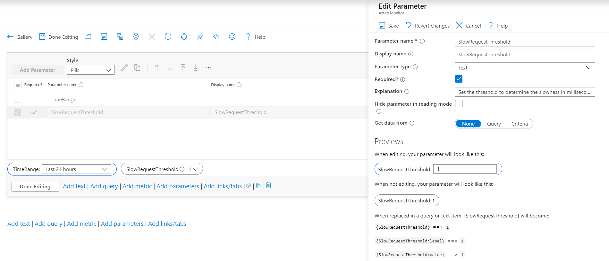
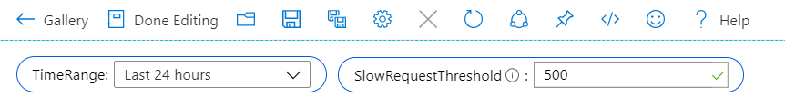
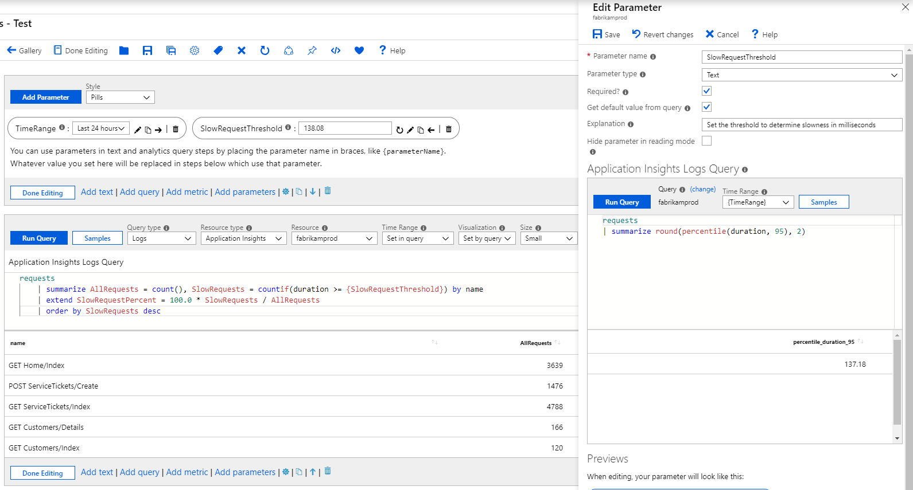
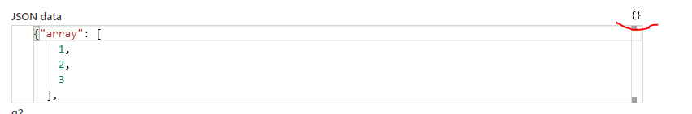

# Text Parameters

Textbox parameters provide a simple way to collect text input from workbook users. They are used when it is not practical to use a drop down to collect the input (e.g. an arbitrary threshold or generic filters). Workbooks allow authors to get the default value of the textbox from a query. This allows interesting scenarios like setting the default threshold based on the p95 of the metric.

A common use of textboxes is as internal variables used by other workbook controls. This is done by leveraging a [query for default values](#setting-default-values-using-queries) or by defining a set of [criteria](Criteria.md) from the values of previous parameters, and making the input control invisible in read-mode. For example, a user may want a threshold to come from a formulae (not a user) and then use the threshold in subsequent queries.

## Creating a text parameter
1. Start with an empty workbook in edit mode.
2. Choose _Add parameters_ from the links within the workbook.
3. Click on the blue _Add Parameter_ button.
4. In the new parameter pane that pops up enter:
    1. Parameter name: `SlowRequestThreshold`
    2. Parameter type: `Text`
    3. Required: `checked`
    4. Get data from: `None`
5. Choose 'Save' from the toolbar to create the parameter.



This is how the workbook will look like in read-mode.



## Parameter field style
Text parameter supports following field style:

1. Standard: A single line text field.


2. Password: A single line password field. The password value is only hidden on UI when user types. The value is still fully accessible as a param value when referred and it is stored unencrypted when workbook is saved.


3. Multiline: A multiline text field with support of rich intellisense and syntax colorization for following languages:
    - Text
    - Markdown
    - Json
    - Sql
    - TypeScript
    - Kql
    - Toml

    User can also specify the height for the multiline editor.


## Referencing a text parameter
1. Add a query control to the workbook and select an Application Insights resource.
2. In the KQL box, add this snippet:
    ```
    requests
    | summarize AllRequests = count(), SlowRequests = countif(duration >= {SlowRequestThreshold}) by name
    | extend SlowRequestPercent = 100.0 * SlowRequests / AllRequests
    | order by SlowRequests desc
    ```
3. This expands on query evaluation time to `| where timestamp > ago(1d)` which is the time range value of the parameter.
    ```
    requests
    | summarize AllRequests = count(), SlowRequests = countif(duration >= 500) by name
    | extend SlowRequestPercent = 100.0 * SlowRequests / AllRequests
    | order by SlowRequests desc
    ```
4. Run query to see the results


## Setting default values using queries
1. Start with an empty workbook in edit mode.
2. Choose _Add parameters_ from the links within the workbook.
3. Click on the blue _Add Parameter_ button.
4. In the new parameter pane that pops up enter:
    1. Parameter name: `SlowRequestThreshold`
    2. Parameter type: `Text`
    3. Required: `checked`
    4. Get data from: `Query`
5. In the KQL box, add this snippet:
    ```
    requests
    | summarize round(percentile(duration, 95), 2)
    ```
    This query sets the default value of the text box to the 95th percentile duration for all requests in the app.
6. Run query to see the result
7. Choose 'Save' from the toolbar to create the parameter.



> Note: while default example queries Application Insights data, the approach can be used for any log based data source - Log Analytics, Azure Resource Graph, etc.

## Adding Validations
For Standard/Password text parameters, user can add validations rule that are applied to the text field. Add a valid regex with error message. If message is set, it is shown as error when field is invalid.

If match is selected, the field is valid if value matches the regex and if match is not selected then the field is valid if it doesn't match the regex.


## Format JSON Data

If JSON is selected as the language for the multiline text field, then the field will have a button that will format the JSON data of the field. User can also use the shortcut `(ctrl + \)` to format the JSON data.




If data is coming from a query, user can select the option to pre-format the JSON data returned by the query.


## Setting values using Criteria
Refer to the [Criteria](Criteria.md) documentation.

See also:

[Parameter Options](formatting.md)