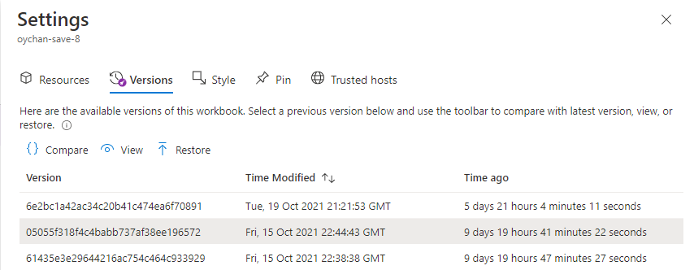

> [!NOTE] 
> This documentation for Azure workbooks is now located at: https://learn.microsoft.com/en-us/azure/azure-monitor/visualize/workbooks-configurations
> Please **do not** edit this file. All up-to-date information is in the new location and documentation should only be updated there.

# Workbook Settings

In the workbooks settings context pane, there are a couple of tabs which can be configured for the workbook.

## Resources
These are the resources that will appear as default selections in steps in this workbook.

One of them will be marked as the 'Owner' resource. That's where the workbook will go when you save, and which workbooks and templates you'll see when browsing. The owner resource cannot be removed.

In the grid shown, click on `Add Resources` to browse for any resource that you would like to add to the default selections of the workbook. Also you can multiselect resources in the grid and `Remove Selected Resources` as well. When you are done adding and removing resources, click on `Apply Changes`.

## Versions
This tab contains a list of all the available versions of this workbook. Select a version and use the toolbar to [Compare](#compare), [View](#view), and [Restore](#restore). Previous workbook versions are available for 90 days.

> **_NOTE_**: Version history is not available for [Bring your own storage](../BYOS/BringYourOwnStorage.md) workbooks.

### Compare
When comparing, you'll be able to see the previous workbook as a JSON, versus the most recently saved version.

### View
This will open the selected version of the workbook in a context pane.

### Restore
Restoring the selected version will open the prompt to confirm the action. Once confirmed, `Restore` will save a new copy of the workbook with the contents of the selected version and overwrite any existing current content.

## Style
In this tab, you can set a padding and spacing style for the whole workbook. The possible options are `Wide`, `Standard`, `Narrow`, `None`. `Standard` is the default style setting.

## Pin
While in pin mode, you can select `Pin Workbook` to pin an item from this workbook to a dashboard. Choose `Link to Workbook`, and a standard static link to this workbook will be pinned on your dashboard. Otherwise you can choose a specific step that will be pinned.

## Trusted hosts
Enable trusted source or mark this workbook as trusted in this browser

| Control      | Definition |
| ----------- | ----------- |
| Mark Workbook as trusted      | If enabled, this Workbook will be able to call any endpoint, whether the host is marked as trusted or not. A workbook is trusted if it is a new workbook, an existing workbook is saved, or it is explicitly marked as a trusted workbook   |
| URL grid   | A grid to explicitly add trusted hosts.        |
