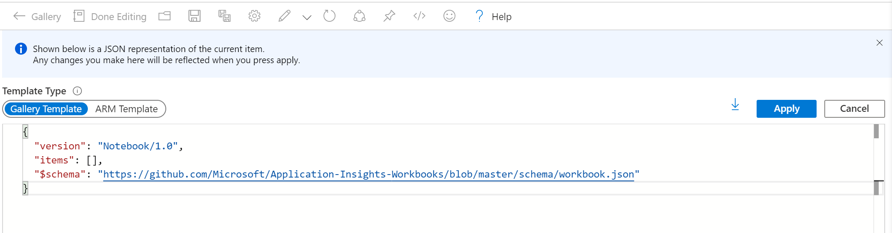
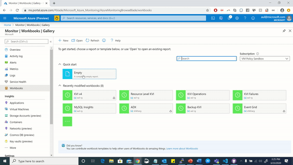

# Using Advanced Editor for Importing Workbooks

Azure Monitor Workbooks supports an advanced editor, where users create and modify workbooks in the JSON and ARM formats.

From the Workbooks [GitHub template library](https://github.com/microsoft/Application-Insights-Workbooks/tree/templatedocs/Workbooks), Authors may wish to import specific Workbook JSON files into the portal.

To do so, follow this step-by-step guide on how to access the Advanced Editor and upload your own Workbook file.

1. Create a new empty workbook
2. Along the top toolbar, select the `Advanced Editor` icon, denoted by `</>`.

3. This will open up an interface that opens up to the `Advanced Editor`, which defaults to the JSON content.

4. Delete all of the existing content and paste your Workbook JSON into the editor.

5. Select the apply option and this will render your Workbook template. Note that this may take longer for larger Workbook files.

6. Select the `Done Editing` button to enter the reading mode for your template

7. (Optional) You can choose to save the template using the `Save` button from the top toolbar

### Video Demonstration

