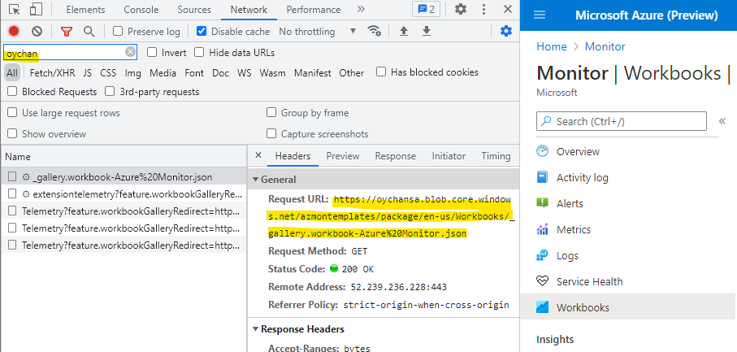

# How to test your changes

Testing changes to a template can be done in two primary ways:

1. [**Using Advanced Mode**](#using-advanced-mode): Works locally in your browser, exclusively for you.
2. [**Redirecting to a GitHub Branch**](#redirecting-the-gallery-to-a-github-branch): Allows anyone with the URL to test changes temporarily; slightly more complicated but widely accessible.

## Using Advanced Mode

If you're only modifying a workbook, you can test your changes locally without any usage of Git. Follow these steps:

1. **Create an empty workbook.**
2. **Access Advanced Mode.**
3. **Paste the contents of the `.workbook` template file into Advanced Mode.**
4. **Click on the `Apply` button.**

> [!TIP]
> If your template content is valid, it will appear in the view. If not, you'll receive an error notification explaining why your content is invalid.

## Redirecting the Gallery to a GitHub Branch
  
> [!IMPORTANT]
> This feature flag is intended for short-term testing and not as a permanent solution.

To test changes in an existing template without merging to master or altering galleries, you can use the `feature.workbookGalleryBranch` setting. This setting instructs the Workbooks view to fetch content from a specific GitHub branch for testing purposes. Other users can also view these changes.

### Steps

1. **Make Changes to Your Branch**: Implement the desired modifications on your branch.
2. **Push to GitHub**: Once changes are made, push the branch to our GitHub repository.
3. **Update Portal URL**: Append `?feature.workbookGalleryBranch=[name of branch]` to the portal URL. For example: `https://portal.azure.com/?feature.workbookGalleryBranch=master`.

   If this worked, a banner will display in the gallery indicating the redirection:

   

   If it did not work, you will see an error banner indicating why it did not work. Most commonly this is a typo in the branch name, or invalid JSON content in your gallery or template files.

### Limitations

- **Performance**: Loading workbooks from GitHub may slow down loading times and lead to throttling errors if too many items are loaded in a short succession of time.

### Troubleshooting

1. How do I know if content is being served from my GitHub branch?
    - Press on `F12` or `Ctrl+Shift+I` to bring up the developer console.
    - Switch to the network tab, and filter by the "GitHub" keyword.
    - Navigate to a workbook gallery (For example: Azure Monitor -> Workbooks)
    - Inspect that the gallery file loaded is from your own gallery:
    
    - Visit your modified workbooks and galleries. Ensure your changes are being reflected.

2. For other general template troubleshooting, see [Template troubleshooting](./Contributing.md#troubleshooting) in the contributing guide.

If after trying these steps you can't deploy your gallery or templates, [file an issue](https://github.com/microsoft/Application-Insights-Workbooks/issues) and we'll help debug the problem.

## "feature.workbookGalleryRedirect" No longer available

> [!WARNING]
> As of June 2024, a previous third testing option, for uploading an entire template gallery package to an external site or storage account for testing, is no longer available. 
>
> Passing the `feature.workbookGalleryRedirect` feature flag will be ignored. Use the [Redirecting to a GitHub branch](#redirecting-the-gallery-to-a-github-branch) instructions above instead.
