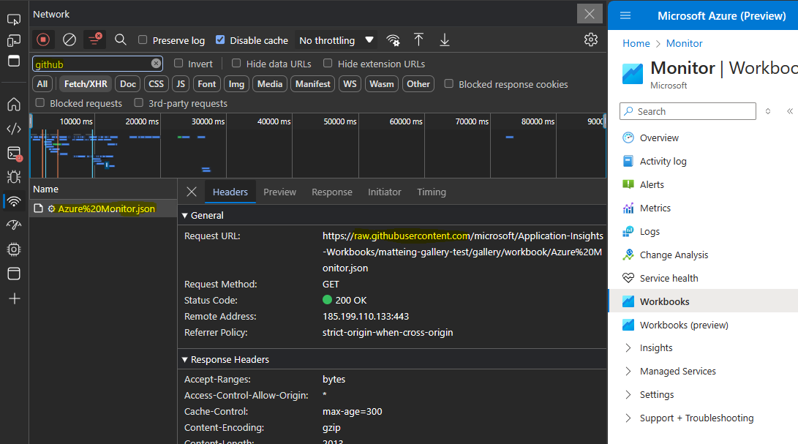

# How to test your changes

There are 3 primary ways to test changes to a template, from simplest to more complicated but more powerful
1. [Using advanced mode](#using-advanced-mode) - this will only work for you, locally in your browser
2. [Redirecting the gallery to a github branch](#redirecting-the-gallery-to-a-github-branch) - can work for anyone with the url, as a short term testing solution
3. [Deploying your own gallery](#deploying-your-own-gallery) - can work for anyone, can add/move items in galleries. most powerful but more setup

## Using Advanced Mode
It is possible to test your changes without merging your content to master.
the simplest possible testing is by opening workbooks in the place you expect your template to work, 
1. Create an empty workbook 
2. Go to advanced mode
3. Paste the contents of the `.workbook` template file into advanced mode
4. Use the `Apply` button

   Assuming your template content is valid, your template will appear in the view. If the template content was not valid, you will get an error notification displaying why your content is not valid.

## Redirecting the gallery to a github branch

If you are only changing the contents of an existing template, not adding new templates or altering which galleries a template appears in, you can use the feature flag `feature.workbookGalleryBranch` setting to tell the Workbooks view to look in a specific published github branch for the new content. Doing testing this way will let other users also see the changes to the template.

1. Make your changes to your branch
2. Push the branch to github
3. Add `?feature.workbookGalleryBranch=[name of branch]` to the portal url, so your URL looks something like [https://portal.azure.com/?feature.workbookGalleryBranch=master](https://portal.azure.com/?feature.workbookGalleryBranch=master)

   If it works correctly, you'll see a banner in the gallery:
   

> **Limitations**
> 1. This only works for existing templates which are already exposed in a gallery, and which have `.workbook` file names that are the same as the parent directory.
> 2. If templates are renamed, moved, or the branch is deleted, this method will stop working.
> 3. This will cause your browser to read directly from `https://raw.githubusercontent.com/microsoft/Application-Insights-Workbooks/`, which may be slower and may cause throttling errors if you attempt to load too many items too quickly. 
>
> This feature flag is intended only for short term test usage, and should not be used as a long term solution.

## Deploying your own gallery
If you are adding new items to a gallery, or adding new gallery entirely, you can use the feature flag `feature.workbookGalleryRedirect` to redirect the entire workbook gallery to a url that you control.

1. Clone the repo, create your local branch, and make your changes locally
2. From the `scripts` folder of the repo, run `processDevPackageOnly.cmd` (ideally from a command prompt so you can see any output/errors)
	- note: repeated runs of this script may generate error lines that files already exist and are being overwritten

   You should now have an `outputs\package` folder in the repo that contains the built package of content, but only the en-us version.
3. Every time you update any content, re-run the `processDevPackageOnly` script to repackage your changes.
4. Copy/upload your package content (see below)
5. Add `?feature.workbookGalleryRedirect=[url to your package]` to the portal url and reload the portal (if you already have other query parameters on the portal url)

   If it works correctly, you'll see a banner in the gallery:
   

> [!NOTE]
> When you access the Package in your browser, you must not put a / (slash) at the end of the Package parameter.
> - Correct: 
>   `https://portal.azure.com/?feature.workbookGalleryRedirect=https://[yourblob].blob.core.windows.net/azure_monitor_workbook_templates/package`
> - In correct: 
>   `https://portal.azure.com/?feature.workbookGalleryRedirect=https://[yourblob].blob.core.windows.net/azure_monitor_workbook_templates/package/`

### Uploading package content
There are 2 ways to host your built packages. Choose one of them.

1. **Setting up a storage account to deploy your package**

    By setting up a storage account to host your changes, you can share the portal link outlined in step 7 with other team members or create a private previews with select customers.
    1. Create azure storage account
    2. In that storage account create blob container, like "azure_monitor_workbook_templates"
    3. In that storage account, [enable CORS rules](https://docs.microsoft.com/en-us/rest/api/storageservices/cross-origin-resource-sharing--cors--support-for-the-azure-storage-services) so your machine will be able to read from that storage account
    4. In that storage account, [configure public access](https://docs.microsoft.com/en-us/azure/storage/blobs/anonymous-read-access-configure?tabs=portal) to enable unauthenticated access to that storage account.
    5. Upload contents of `outputs\package` directory to the blob container (so you now have a path like `azure_monitor_workbook_templates/package` in the storage account)
    - The [Microsoft Azure Storage Explorer](https://azure.microsoft.com/en-us/features/storage-explorer/#features) allows you to upload entire directories directly to the container.
    6. Get the url to that folder; it will be something like `https://[name of storage account].blob.core.windows.net/azure_monitor_workbook_templates/package`
    - At this point, attempt to navigate directly to that folder url from a browser to make sure you have the right settings. (note that navigating directly will not test CORS, only access from the portal will)
    7. Set that as a feature flag setting on the portal url. the feature flag will be `feature.workbookGalleryRedirect=[your url]`
    - You'll end up with something like `https://portal.azure.com/?feature.workbookGalleryRedirect=https://[yourblob].blob.core.windows.net/azure_monitor_workbook_templates/package`
    8. Test this in the portal. Ensure you have no network errors in the network console, this is where you will see CORS related errors about missing headers if CORS is not enabled.
    9. As you make changes to your templates, rebuild the package and re-upload changed content.

2. **Running a local web server**

    If you are already running something like Apache or IIS locally and you don't intend on sharing your changes, you can upload built package to your web server.
    1. Use your web server settings to expose the `outputs\package` folder as readable.  Ensure it is available via HTTPS, and ensure that CORS is enabled to allow loading that url from the portal.
    2. Set that as a feature flag setting on the portal url. the feature flag will be `feature.workbookGalleryRedirect=[your url]`
    - so you'll end up with something like `https://portal.azure.com/?feature.workbookGalleryRedirect=https://localhost/package`
    3. Test this in the portal. Ensure you have no network errors in the network console, this is where you will see CORS related errors about missing headers if CORS is not enabled.
    4. As you make changes to your templates, rebuild the package and re-upload changed content.

### Troubleshooting deployed gallery
1. How do I know if content is being served from my gallery?
    - Press on `F12` or `Ctrl+Shift+I` to bring up the developer console.
    - Switch to the network tab, and filter to your storage container name or local web server name
    - Navigate to a workbook gallery (For example: Azure Monitor -> Workbooks)
    - Inspect that the gallery file loaded is from your own gallery
    

2. After making changes, running the processDevPackage.cmd, and uploading the contents to my gallery, I don't see my changes.
    - Press on `F12` or `Ctrl+Shift+I` to bring up the developer console.
    - Switch to the network tab
    - Ensure that the checkbox 'Disabled cache' is checked
    - With the developer console still open, refresh the gallery, and you should see your changes

