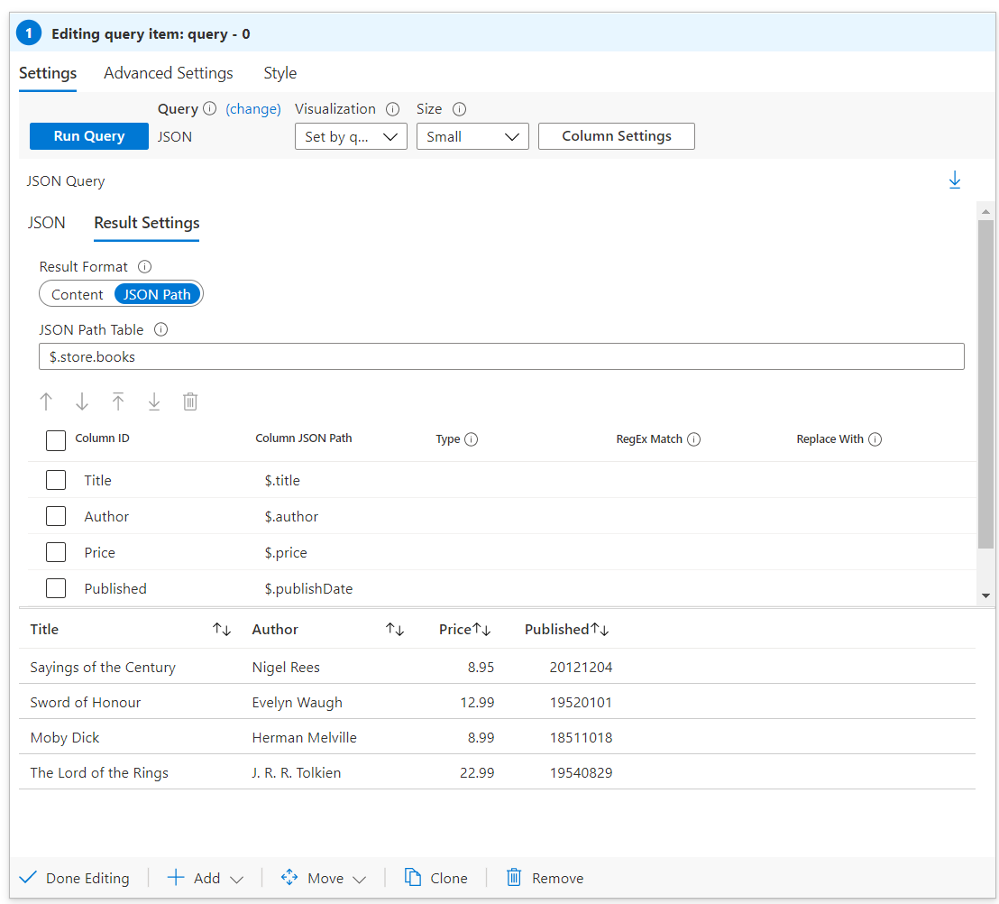

# JSON Path

Workbooks is able to query data from many sources. Some endpoints, such as Azure Resource Manager or custom endpoint, can return results in JSON. If the JSON data returned by the queried endpoint is not configured in a format that you desire, JSONPath can be used to transform the results.

JSONPath is a query language for JSON that is similar to XPath for XML. Like XPath, JSONPath allows for the extraction and filtration of data out of a JSON structure.

Click [here](https://aka.ms/jsonpath) to learn more about JSON Path.

By using JSONPath transformation, Workbook authors are able to convert JSON into a table structure. The table can then be used to plot Workbook [visualizations](../Visualizations/Visualizations.md).

## Using JSONPath

1. Switch the workbook to edit mode by clicking on the _Edit_ toolbar item.
2. Use the _Add query_ link to add a query control to the workbook. 
3. Select the query type as _JSON_
4. Use the JSON editor to enter the following JSON snippet

```json
{ "store": {
    "books": [ 
      { "category": "reference",
        "author": "Nigel Rees",
        "title": "Sayings of the Century",
        "price": 8.95
      },
      { "category": "fiction",
        "author": "Evelyn Waugh",
        "title": "Sword of Honour",
        "price": 12.99
      },
      { "category": "fiction",
        "author": "Herman Melville",
        "title": "Moby Dick",
        "isbn": "0-553-21311-3",
        "price": 8.99
      },
      { "category": "fiction",
        "author": "J. R. R. Tolkien",
        "title": "The Lord of the Rings",
        "isbn": "0-395-19395-8",
        "price": 22.99
      }
    ],
    "bicycle": {
      "color": "red",
      "price": 19.95
    }
  }
}
```

Let’s assume we are given the above JSON object as a representation of a store's inventory. Our task is to create a table of the store's available books by listing their titles, authors, and prices.

5. Select the _Result settings_ tab, and switch the result format from `Content` to `JSON Path`
6. Apply the following JSON Path Settings:
    1. JSON Path Table: `$.store.books`. This field represents the path to the root of the table. In this case, we care about the store's book inventory. The table path filters the JSON to the book information.
    2. Column IDs: `Title`, `Author`, `Price`. These will be the column headers.
    3. Column JSON Paths: `$.title`, `$.author`, `$.price`. These fields represent the path from the root of the table to the column value. For each row in the table, the path will be applied.

7. Apply the above settings by clicking _Run Query_.


