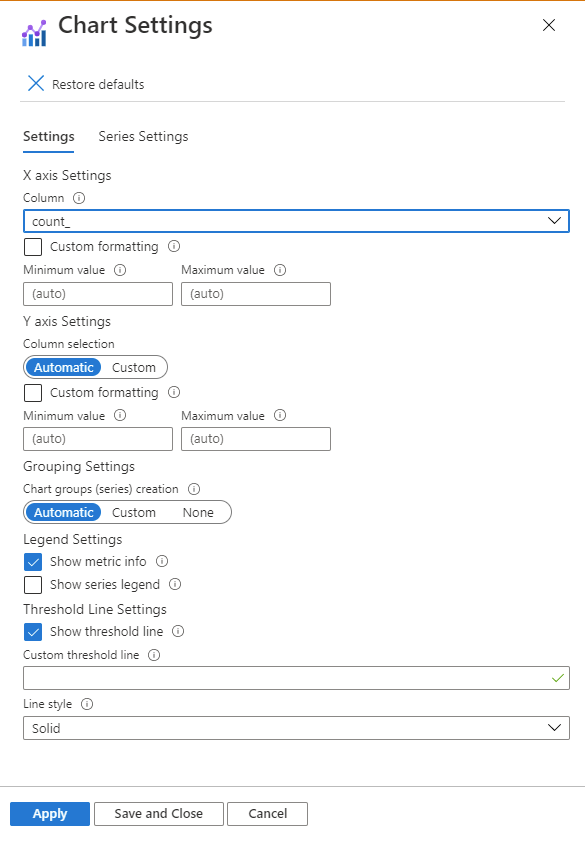
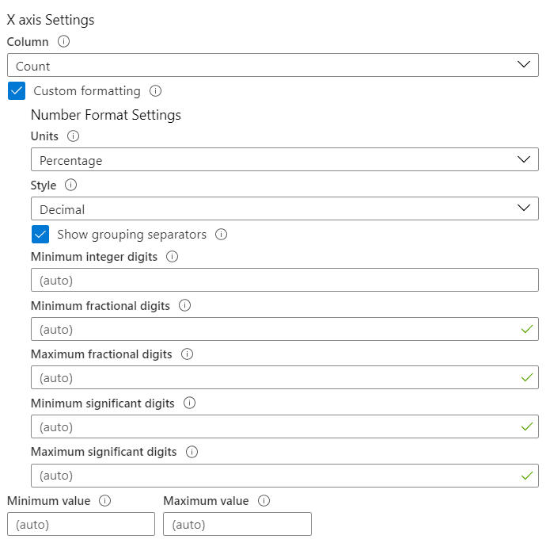
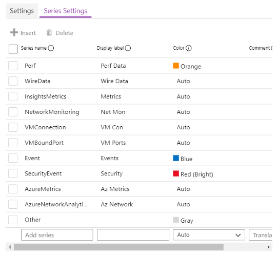

# Chart Visualization

Workbooks allow monitoring data to be presented as charts. Supported chart types include line, bar, bar categorical, area, scatter plots, pie and time. Authors can choose to customize the height, width, color palette, legend, titles, no-data message, etc. of the chart, and customize axis types and series colors using chart settings.

Workbooks supports charts for both analytics logs and metric data sources. Use the links below to learn more about enabling charts for these.

* [Log charts](LogCharts.md)
* [Metric charts](MetricCharts.md)

## Time-series examples
### Area chart

### Segmented line chart

### Segmented bar chart

### Scatter chart

## Categorical examples
### Pie chart

### Bar categorical or Histogram

# Chart Settings
Authors can use chart settings to customize which fields are used in the chart axes, the axis units, custom formatting, ranges, grouping behaviors, legends, and series colors.

### The Settings tab
The settings tab controls:
* the axis settings, including which fields, custom formating that allows users to set the number formatting to the axis values, and custom ranges.
* grouping settings, including which field, the limits before an "Others" group is created
* legend settings, including showing metrics (series name, colors and numbers) at the bottom, and/or a legend (series names and colors)

#### Custom Formatting
The custom formatting is same as Grid's custom formatting except "Custom text for missing values" is not applicable for charts. More description [here](https://github.com/microsoft/Application-Insights-Workbooks/blob/master/Documentation/Visualizations/Grid.md#custom-formatting).

### The Series tab
The series settings tab lets you adjust the labels and colors shown for series in the chart.
* The `Series name` field is used to match a series in the data, and if matched, the display label and color will be displayed.
* the `Comment` field is useful for template authors, as this comment may be used by translators to localize the display labels

