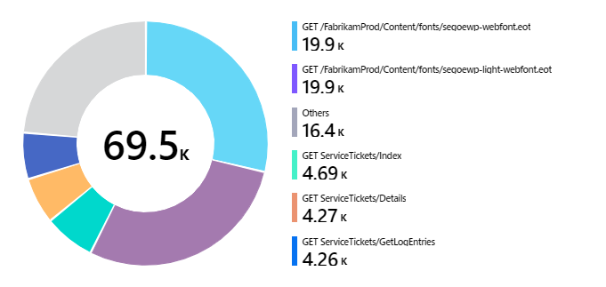
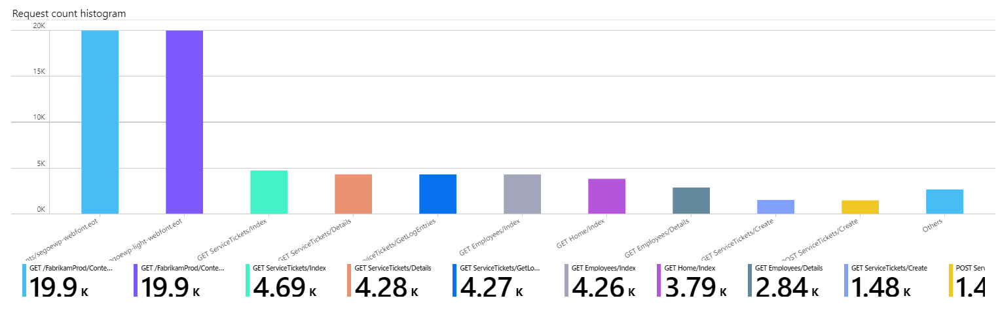

# Chart Visualization

Workbooks allow monitoring data to be presented as charts. Supported chart types include line, bar, bar categorical, area, scatter plots, pie and time. Authors can choose to customize the height, width, color palette, legend, titles, no-data message, etc. of the chart. 

Workbooks supports charts for both analytics logs and metric data sources. Use the links below to learn more about enabling charts for these.

* [Log charts](LogCharts.md)
* [Metric charts](MetricCharts.md)

## Time-series examples
### Area chart

### Segmented line chart

### Segmented bar chart

### Scatter chart

## Categorical examples
### Pie chart

### Bar categorical or Histogram

