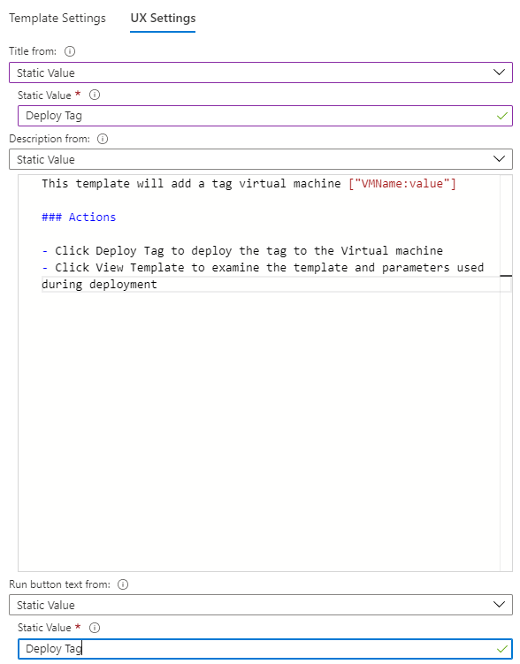

# Grid Visualization

Grids or tables are a common way to present data to users. Workbooks allow users to individually style the columns of the grid to provide a rich UI for their reports. 

The example below shows a grid that combines icons, heatmaps and spark-bars to present complex information. The workbook also provides sorting, an search box and a go-to-analytics button. 


## Adding a log-based grid
1. Switch the workbook to edit mode by clicking on the _Edit_ toolbar item.
2. Use the _Add query_ link to add a log query control to the workbook. 
3. Select the query type as _Log_, resource type (e.g. Application Insights) and the resources to target.
4. Use the Query editor to enter the KQL for your analysis (e.g. VMs with memory below a threshold)
5. Set the visualization to _Grid_
7. Set other parameters if needed - like time range, size, color palette and legend. 

Here is the edit mode version of the log grid above:


## Log chart parameters

| Parameter | Explanation | Example |
| ------------- |:-------------|:-------------|
| `Query Type` | The type of query to use | Log, Azure Resource Graph, etc. |
| `Resource Type` | The resource type to target | Application Insights, Log Analytics, or Azure-first |
| `Resources` | A set of resources to get the metrics value from | MyApp1 |
| `Time Range` | The time window to view the log chart | Last hour, Last 24 hours, etc. |
| `Visualization` | The visualization to use | Grid |
| `Size` | The vertical size of the control | Small, medium, large or full |
| `Query` | Any KQL query that returns data in the format expected by the chart visualization | _requests \| summarize Requests = count() by name_ |

## Simple Grid
Workbooks can render KQL results as a simple table. The grid below shows the count of requests and unique users per request type in an app.


```
requests
| where name !endswith('.eot')
| summarize Requests = count(), Users = dcount(user_Id) by name
| order by Requests desc
```

## Grid Styling
While a plain table shows data, it hard to read and insights don't jump out to you. Styling the grid can help you accomplish this. 

Here is the same grid styled as heatmaps.


Here is the same grid styled as bars.


### Styling a Grid Column
1. Click the _Column Settings_ button on the query control toolbar. 
2. This opens up the _Edit column settings_ context view.
3. Select the column to style.
4. Choose a column renderer (e.g. heatmap, bar, bar underneath, etc.) and related settings to style your column.

Here is an example that styles the _Request_ column as a bar:


### Column Renderers

| Column Renderer | Explanation | Additional Options |
|:------------- |:-------------|:-------------|
| `Automatic` | The default - uses the most appropriate renderer based on the column type  |  |
| `Text` | Renders the column values as text | |
| `Right Aligned` | Similar to text except that it is right aligned | |
| `Date/Time` | Renders a readable date time string | |
| `Heatmap` | Colors the grid cells based on the value of the cell | Color palette and min/max value used for scaling |
| `Bar` | Renders a bar next to the cell based on the value of the cell | Color palette and min/max value used for scaling |
| `Bar underneath` | Renders a bar near the bottom of the cell based on the value of the cell | Color palette and min/max value used for scaling |
| `Spark bars` | Renders a spark bar in the cell based on the values of a dynamic array in the cell. E.g the Trend column form the image at the top | Color palette and min/max value used for scaling |
| `Spark lines` | Renders a spark line in the cell based on the values of a dynamic array in the cell | Color palette and min/max value used for scaling |
| `Icon` | Renders icons based on the text values in the cell. Supported values include: _cancelled, critical, disabled, error, failed, info, none, pending. stopped. question, success, unknown, uninitialized, resource, up, down, left, right, trendup, trenddown, 4, 3, 2, 1, Sev0, Sev1, Sev2, Sev3, Sev4, Fired, Resolved, Available, Unavailable, Degraded, Unknown_ |  |
| `Link` | Renders a link that when clicked performs a configurable action. Use this if you *only* want the item to be a link.  Any of the other types can *also* be a link by using the `Make this item a link` setting.  More information below |  |
| `Location` | Renders a friendly Azure region name based on a region ids |  |
| `Resource type` | Renders a friendly resource type string based on a resource type id  |  |
| `Resource` | Renders a friendly resource name and link based on a resource id  | Option to show the resource type icon  |
| `Resource group` | Renders a friendly resource group name and link based on a resource group id. If the value of the cell is not a resource group, it will be converted to one.  | Option to show the resource group icon  |
| `Subscription` | Renders a friendly subscription name and link based on a subscription id.  if the value of the cell is not a subscription, it will be converted to one.  | Option to show the subscription icon.  |
| `Hidden` | Hides the column in the grid. Useful when the default query returns more columns than needed but a project-away is not desired |  |

### Link Actions
If the `Link` renderer is selected, or the `Make this item a link` checkbox is selected, then the author can  configure a link action that will occur on clicking the cell. This usually is taking the user to some other view with context coming from the cell, or may open up a url.

#### General Link Actions
| Link action | Action on click |
|:------------- |:-------------|
| `Generic Details` | Shows the row values in a property grid context view |
| `Cell Details` | Shows the cell value in a property grid context view. Useful when the cell contains a dynamic type with information (e.g. json with request properties like location, role instance, etc.). |
| `Url` | The value of the cell is expected to be a valid http url, and the cell will be a link that opens up that url in a new tab.|

#### Application Insights
| Link action | Action on click |
|:------------- |:-------------|
| `Custom Event Details` | Opens the Application Insights search details with the custom event id (itemId) in the cell |
| `* Details` | Similar to Custom Event Details, except for dependencies, exceptions, page views, requests and traces. |
| `Custom Event User Flows` | Opens the Application Insights User Flows experience pivoted on the custom event name in the cell |
| `* User Flows` | Similar to Custom Event User Flows except for exceptions, page views and requests |
| `User Timeline` | Opens the user timeline with the user id (user_Id) in the cell |
| `Session Timeline` | Opens the Application Insights search experience for the value in the cell (e.g. search for text 'abc' where abc is the value in the cell) |

`*` denotes a wildcard for the above table

#### Azure Resource
| Link action | Action on click |
|:------------- |:-------------|
| `ARM Deployment` | Deploy an ARM template.  When this item is selected, additional fields are displayed to let the author configure which ARM template to open, parameters for the template, etc. [See ARM Deployment Link Settings](#ARM-Deployment-link-settings)   |
| `Create Alert Rule` | Creates an Alert rule for a resource.  |
| `Custom View` | Opens a custom View. When this item is selected, additional fields are displayed to let the author configure the View extension, View name, and any parameters used to open the View. [See Custom View](#custom-view-link-settings) |
| `Metrics` | Opens a metrics view  |
| `Resource overview` | Open the resource's view in the portal based on the resource id value in the cell.  The author can also optionally set a `submenu` value that will open up a specific menu item in the resource view. |
| `Workbook (template)` | Open a workbook template.  When this item is selected, additional fields are displayed to let the author configure what template to open, etc.  |

#### Link settings
When using the Link renderer, the following settings are available:


| Setting | Explanation |
|:------------- |:-------------|
| `View to open` | Allows the author to select one of the actions enumerated above |
| `Menu item` | If "Resource Overview" is selected, this is the menu item in the resource's overview to open.  This can be used to open alerts or activity logs instead of the "overview" for the resource. Menu item values are different for each Azure Resourcetype|
| `Link label` | If specified, this value will be displayed in the grid column. If this value is not specified, the value of the cell will be displayed. If you want another value to be displayed, like a heatmap or icon, do not use the `Link` renderer, instead use the appropriate renderer and select the `Make this item a link` option |
| `Open link in Context Blade` | If specified, the link will be opened as a popup "context" view on the right side of the window instead of opening as a full view. |

When using the `Make this item a link` option, the following settings are available:

| Setting | Explanation |
|:------------- |:-------------|
| `Link value comes from` | When displaying a cell as a renderer with a link, this field specifies where the "link" value to be used in the link comes from, allowing the author to select from a dropdown of the other columns in the grid. For example, the cell may be a heatmap value, but you want the link to open up the Resource Overview for the resource id in the row. In that case, you'd set the link value to come from the `Resource Id` field.
| `View to open` | same as above. |
| `Menu item` | same as above. |
| `Open link in Context Blade` | same as above. |

#### ARM Deployment link settings
If the selected link type is `ARM Deployment` the author must specify additional settings to open an ARM deployment. There are two main tabs for configuration. 

##### Template Settings

This section defines where the template should come from and the parameters used to run the ARM deployment.

| Source | Explanation |
|:------------- |:-------------|
|`Resource group id comes from` | The resource id is used to manage deploy resources. The subscription is used to manage deployed resources and costs. The resource groups are used like folders to organize and manage all your resources. If this value is not specified, the deployment will fail. Select from `Cell`, `Column`, or `Parameter` in [Link sources](#link-sources).|
|`ARM template URI from` | The URI to the ARM template itself. The template URI needs to be accessible to the users who will deploy the template. Select from `Cell`, `Column`, `Parameter`, or `Static Value`  in [Link sources](#link-sources). For starters, take a look at our [Quickstart templates](https://azure.microsoft.com/en-us/resources/templates/).|
|`ARM Template Parameters` | This section defines the template parameters used for the template URI defined above. These parameters will be used to deploy the template on the run page. The grid contains an expand toolbar button to help fill the parameters using the names defined in the template URI and set it to static empty values. This option can only be used when there are no parameters in the grid and the template URI has been set.|


##### UX Settings

This section configures what the users will see before they run the ARM deployment.

| Source | Explanation |
|:------------- |:-------------|
|`Title from` | Title used on the run view. Select from `Cell`, `Column`, `Parameter`, or `Static Value` in [Link sources](#link-sources).|
|`Description from` | This is the markdown text used to provide a helpful description to users when they want to deploy the template. Select from `Cell`, `Column`, `Parameter`, or `Static Value`  in [Link sources](#link-sources). <br/><br/> **NOTE** If `Static Value` is selected, a multi-line text box will appear. In this text box you can resolve parameters using `{paramName}`. Also you can treat columns as parameters by appending `_column` after the column name like `{columnName_column}`. In the example image below, we can reference the column `VMName` by writing `{VMName_column}`. The value after the colon is the [parameter formatter](../Parameters/Parameters.md#parameter-formatting), in this case it's `value`. |
|`Run button text from` | Label used on the run (execute) button to deploy the ARM template. This is what users will click on to start deploying the ARM template.|



After these configurations are set, when the user clicks on the link, it will open up the view with the UX described in [UX Settings](#UX-settings). From here, if the user clicks on the button specified by `Run button text from` it will deploy an ARM template using the values from [Template Settings](#template-settings).


#### Custom View link settings

Use this to open Custom Views in the Azure Portal. Verify all of the configuration and settings. Incorrect values will cause errors in the portal, or fail to open the views correctly. There are two ways to configure the settings, via the `Form` or via `URL`.

##### Form

| Source | Explanation |
|:------------- |:-------------|
|`Extension name` | The name of the extension that hosts the name of the View.|
|`View name` | The name of the View to open. |
|`View Parameters` | These are the inputs for the View. <ul><li>`Parameter Name`: The name of the View input parameter</li><li>`Parameter Comes From`: Where the value of the View parameter should come from. Select from `Cell`, `Column`, `Parameter`, or `Static Value`  in [Link sources](#link-sources). **NOTE** If `Static Value` is selected, the parameters can be resolvedusing brackets like `{paramName}` in the text box. Also, columns can be treated as parameters columns by appending `_column` after the column name like `{columnName_column}`.</li><li>`Parameter Value`: depending on `Parameter Comes From`, this will be a dropdown of available parameters, columns, or a static value.</li>


##### URL

Paste a Portal URL containing the extension, name of the view, and any inputs needed to open the view. After clicking `Initialize Settings`, it will populate the `Form` for the author to add/modify/remove any of the View inputs.


#### Workbook (template) link settings
If the selected link type is `Workbook (Template)` the author must specify additional settings to open up the correct workbook template. The settings below have options for how the grid will find the appropriate value for each of the settings. 


| Setting | Explanation |
|:------------- |:-------------|
| `Workbook owner Resource Id` | This is the Resource Id of the Azure Resource that "owns" the workbook. Commonly it is an Application Insights resource, or a Log Analytics Workspace. Inside of Azure Monitor, this may also be the literal string `"Azure Monitor"`. When the workbook is Saved, this is what the workbook will be linked to. |
| `Workbook resources` | An array of Azure Resource Ids that specify the default resource used in the workbook. For example, if the template being opened shows Virtual Machine metrics, the values here would be Virtual Machine resource ids.  Many times, the owner and resources are set to the same settings. |
| `Template Id` | Specify the name of the template to be opened. If this is a community template from the gallery (the most common case), prefix the value with `Community-`, like `Community--Workbooks/Performance/Apdex`. |
| `Workbook Type` | Specify the kind of workbook template to open. The most common cases use the `Default` or `Workbook` option to use the value in the current workbook. |
| `Gallery Type` | This specifies the gallery type that will be displayed in the "Gallery" view of the template that opens. The most common cases use the `Default` or `Workbook` option to use the value in the current workbook. |

For each of the above settings, the author must pick where the value in the linked workbook will come from. See [Link Sources](#Link-sources).

When the workbook link is opened, the new workbook view will be passed all of the values configured from the settings above, along with the values of any parameters set in the workbook to that point (including any parameters that would be exported from the row selection of the grid). This is commonly used to allow a "downstream" workbook to "inherit" a time range setting from the current workbook. The parameter *names* must be the same in both workbooks for this parameter value inheritance to work. 

#### Link sources
| Source | Explanation |
|:------------- |:-------------|
| `Cell` | This will use the value in that cell in the grid as the link value |
| `Column` | When selected, another field will be displayed to let the author select another column in the grid.  The value of that column for the row will be used in the link value. This is commonly used to enable each row of a grid to open a different template, by setting `Template Id` field to `column`, or to open up the same workbook template for different resources, if the `Workbook resources` field is set to a column that contains an Azure Resource Id |
| `Parameter` | When selected, another field will be displayed to let the author select a parameter. The value of that parameter will be used for the value when the link is clicked |
| `Static value` | When selected, another field will be displayed to let the author type in a static value that will be used in the linked workbook. This is commonly used when all of the rows in the grid will use the same value for a field. |
| `Step` | Use the value set in the current step of the workbook. This is common in query and metrics steps to set the workbook resources in the linked workbook to those used *in the query/metrics step*, not the current workbook |
| `Workbook` | Use the value set in the current workbook. |
| `Default` | Use the default value that would be used if no value was specified. This is common for Gallery Type, where the default gallery would be set by the type of the owner resource |

### Custom Formatting
Workbooks also allows users to set the number formatting of your cell values. They can do so by clicking on the _Custom formatting_ checkbox when available.

Number formatting options include:

| Formatting option | Explanation |
|:------------- |:-------------|
| `Units` | The units for the column - various options for percentage, counts, time, byte, count/time, bytes/time, etc. For example, the unit for a value of 1234 can be set to milliseconds and its rendered as 1.234s |
| `Style` | The format to render it as - decimal, currency, percent |
| `Show group separator` | Checkbox to show group separators. Renders 1234 as 1,234 in the US |
| `Minimum integer digits` | Minimum number of integer digits to use (default 1) |
| `Minimum fractional digits` | Minimum number of fractional digits to use (default 0)  |
| `Maximum fractional digits` | Maximum number of fractional digits to use |
| `Minimum significant digits` | Minimum number of significant digits to use (default 1) |
| `Maximum significant digits` | Maximum number of significant digits to use |
| `Custom text for missing values` | When a data point does not have a value, show this custom text instead of a blank |

### Custom Date Formatting
When the author has specified that a column is set to the Date/Time renderer, the author can specify custom date formatting options by using the '_Custom date formatting' checkbox.

Date formatting options include

| Formatting option | Explanation |
|:------------- |:-------------|
| `Style` | The format to render a date as short, long, full formats, or a time as short or long time formats. |
| `Show time as` | Allows the author to decide between showing the time in local time (default), or as UTC. depending on the date format style selected, the UTC/time zone information may not be displayed. |


## Examples
### Spark lines and Bar Underneath
This example shows request counts and its trend by request name


```
requests
| make-series Trend = count() default = 0 on timestamp from ago(1d) to now() step 1h by name
| project-away timestamp
| join kind = inner (requests
    | summarize Requests = count() by name
    ) on name
| project name, Requests, Trend
| order by Requests desc
```

### Heatmap with shared scales and custom formatting
This example shows various request duration metrics and its counts. The Heatmap renderer uses the minimum and maximum value set in settings, or calculates a minimum and maximum value for the column, and assigns a background color from the selected palette for the cell based on the value of the cell relative to the minimum and maximum value of the column.


```
requests
| summarize Mean = avg(duration), (Median, p80, p95, p99) = percentiles(duration, 50, 80, 95, 99), Requests = count() by name
| order by Requests desc
```

In the above example, a shared palette (green to red) and scale is used to color the mean/median/p80/p95/p99 columns, and a separate palette (blue) is used for the Requests column.

#### Shared scale
The way to get a shared scale is:
1. Use regular expressions to select more than one columns to apply a setting to. For example set the column name to _Mean|Median|p80|p95|p99_ to select them all.
2. Delete default settings for the individual columns. 

This will cause the new multi-column setting to apply its settings include a shared scale.


### Icons to represent status
This example shows custom status of requests based on the p95 duration


```
requests
| summarize p95 = percentile(duration, 95) by name
| order by p95 desc
| project Status = case(p95 > 5000, 'critical', p95 > 1000, 'error', 'success'), name, p95
```

Supported icon names include: cancelled | critical | disabled | error | failed | info | none | pending | stopped |question | success | unknown | warning | uninitialized | resource | up | down | left | right | trendup | trenddown | 4 | 3 | 2 | 1 | Sev0 | Sev1 | Sev2 | Sev3 | Sev4 | Fired | Resolved | Available | Unavailable | Degraded | Unknown | Blank

### Sample: using thresholds with links to assign icons and open different workbooks

For example, using the following JSON query inside a workbook on an Application Insights resource:
```json
[ 
    { "name": "warning", "link": "Community-Workbooks/Performance/Performance Counter Analysis" },
    { "name": "info", "link": "Community-Workbooks/Performance/Performance Insights" },
    { "name": "error", "link": "Community-Workbooks/Performance/Apdex" }
]
```

And the following threshold settings:


And the following workbook link settings:


Will result in the following grid:


Where each link in the grid opens up a different workbook template for that Application Insights resource.

