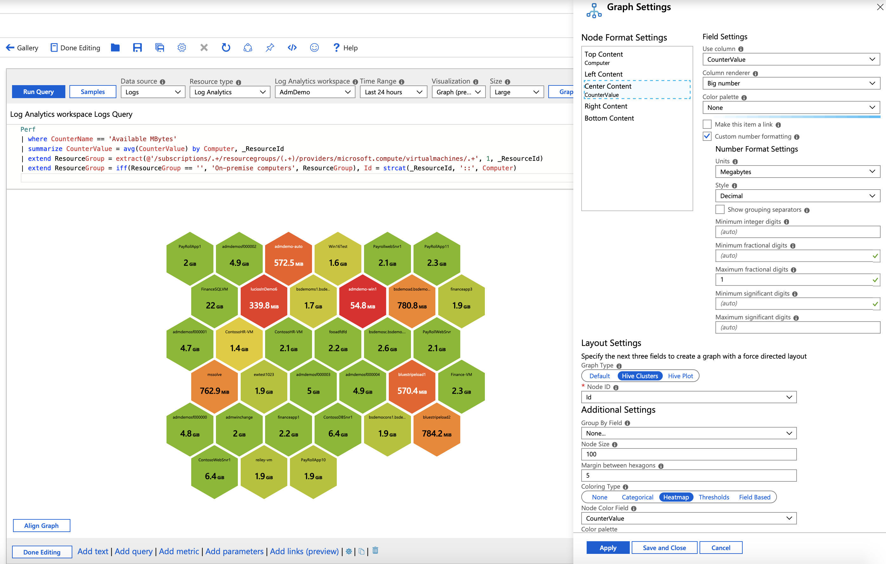

# Honey Comb Visualization

Honey combs allows high density views of metrics or categories that can optionally be grouped as clusters. It is particularly useful in visually identifying hotspots and drilling in further.

The image below shows the CPU utilization of virtual machines across two subscriptions. Each cell represents a virtual machine and the color/label represents it's average CPU utilization (reds are hot machines). The virtual machines are clustered by subscription.


## Adding a Honey Comb
1. Switch the workbook to edit mode by clicking on the _Edit_ toolbar item.
2. Use the _Add query_ link to add a log query control to the workbook. 
3. Select the query type as _Log_, resource type as Log Analytics and point to a workspace that has virtual machine performance logs.
4. Use the Query editor to enter the KQL for your analysis
    ```
    Perf
    | where CounterName == 'Available MBytes'
    | summarize CounterValue = avg(CounterValue) by Computer, _ResourceId
    | extend ResourceGroup = extract(@'/subscriptions/.+/resourcegroups/(.+)/providers/microsoft.compute/virtualmachines/.+', 1, _ResourceId)
    | extend ResourceGroup = iff(ResourceGroup == '', 'On-premise computers', ResourceGroup), Id = strcat(_ResourceId, '::', Computer)
    ```
7. Set the visualization to _Graph_
8. Click the _Graph Settings_ button to open the settings pane
9. In _Layout Fields_ at the bottom, set:
    1. Graph type: `Hive Clusters`
    2. Node Id: `Id`
    3. Group by: `None`
    4. Node Size: `100`
    5. Margin between hexagons: `5`
    6. Coloring type: `Heatmap`
    7. Node Color Field: `CounterValue`
    8. Color palette: `Red to Green`
    9. Minimum value: `100`
    10. Maximum value: `2000`
10. In _Node Format Settings_ at the top, set:
    1. _Top Content_- Use Column: `Computer`, Column Renderer: `Text`
    2. _Center Content_- Use Column: `CounterValue`, Column Renderer: `Big Number`, Color Palette: `None`
    3. Custom number formatting: `Checked`
    4. Units: `Megabytes`
    5. Maximum fractional digits: `1`
10. Click the _Save and Close_ button at the bottom of the pane.




## Honey Comb Layout Settings

| Setting | Explanation |
|:------------- |:-------------|
| `Node Id` | Selects a column that provides the unique id of nodes. Value of the column can be string or a number |
| `Group By Field` | Select the column to cluster the nodes on. |
| `Node Size` | Sets the size of the hexagonal cells. Use with the `Margin between hexagons` property to customize the look of the honey comb chart |
| `Margin between hexagons` | Sets the gap between the hexagonal cells. Use with the `Node size` property to customize the look of the honey comb chart |
| `Coloring type` | Selects the scheme to use to color the node. |
| `Coloring type` | Selects a column that provides the metric on which the node areas will be based on |

## Node Coloring Types

| Coloring Type | Explanation |
|:------------- |:-------------|
| `None` | All nodes have the same color |
| `Categorical` | Nodes are assigned colors based on the value or category from a column in the result set. In the example above, the coloring is based on the column _Kind_ of the result set. Supported palettes are `Default`, `Pastel` and `Cool tone`  |
| `Heatmap` | In this type, the cells are colored based on a metric column and a color palette. This provides a simple way to highlight metrics spreads across cells. |
| `Thresholds` | In this type, cell colors are set by threshold rules (e.g. _CPU > 90%  => Red, 60% > CPU > 90% => Yellow, CPU < 60% => Green_) |
| `Field Based` | In this type, a column provides specific RGB values to use for the node. Provides the most flexibility but usually requires more work to enable.  |

## Node Format Settings
Honey comb authors can specify what content goes to the different parts of a node - top, left, center, right and bottom. They are free to use any of renderers workbook supports (text, big number, spark lines, icon, etc.)


