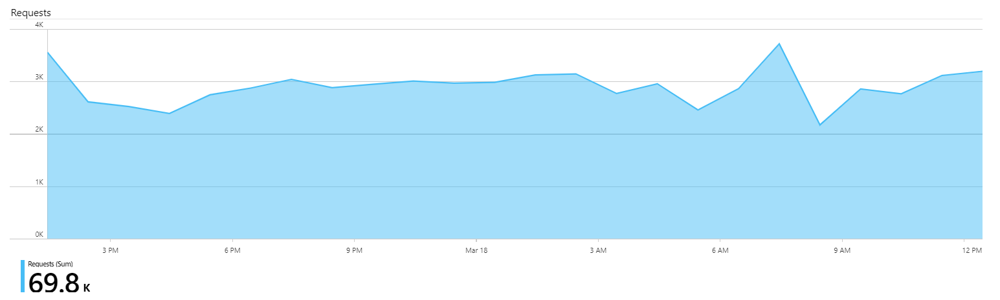
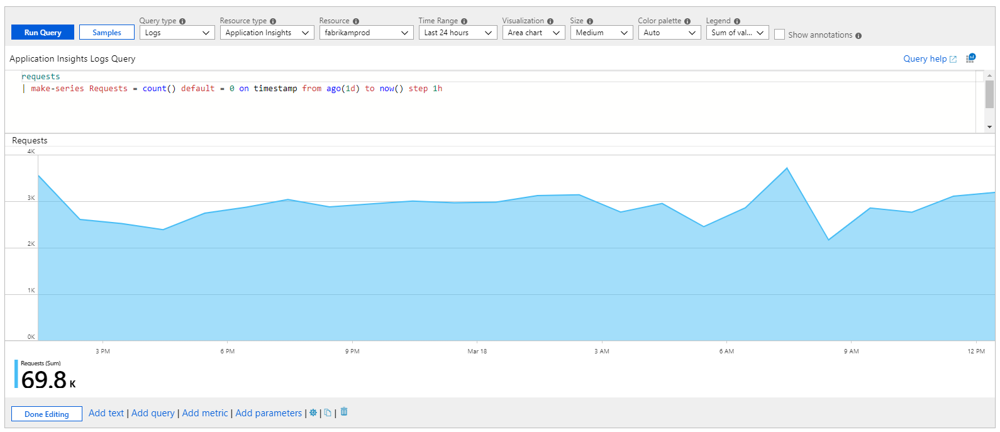
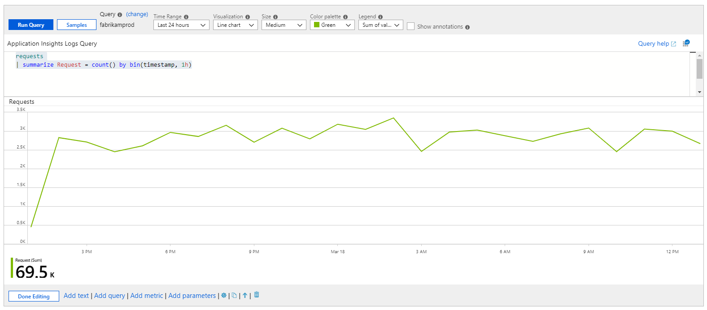
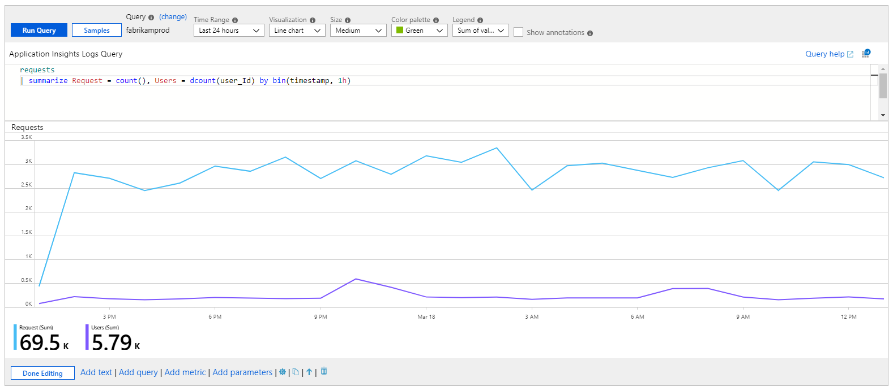
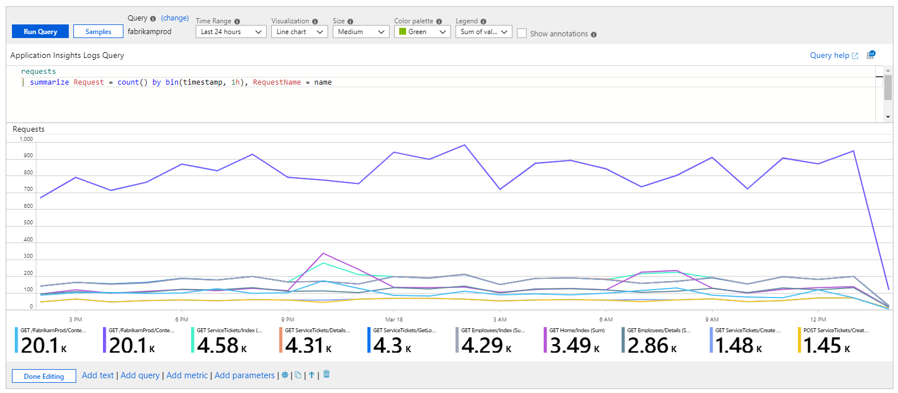
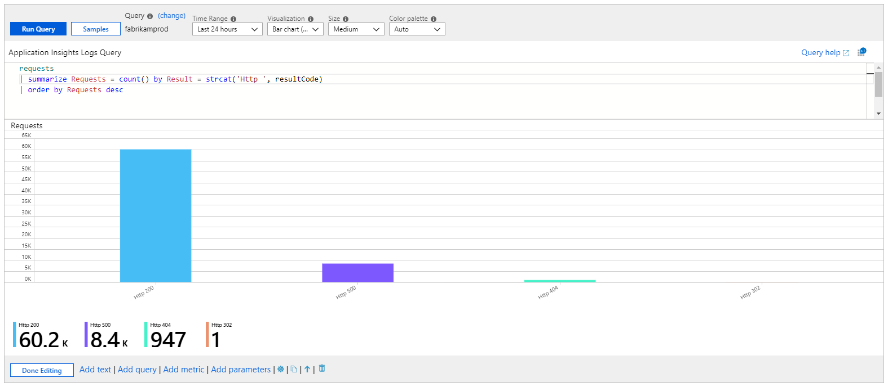
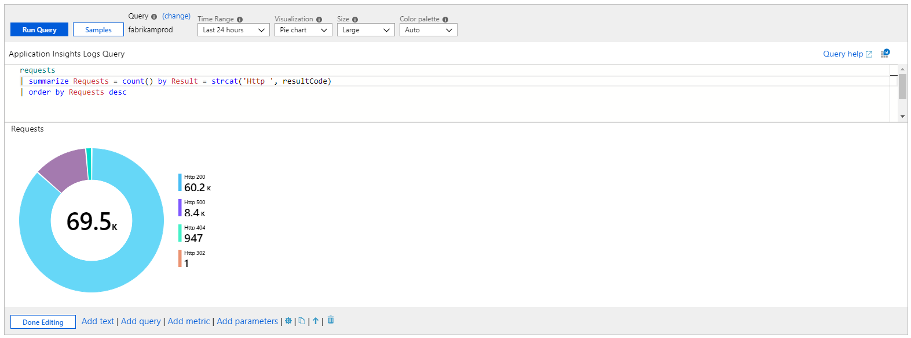

# Log Charts

Azure Monitor logs gives resource owners detailed information about the workings of their apps and infrastructure. Unlike metrics, log information is not collected by default and requires some kind of collection on-boarding. However, when present logs provide a lot of information about the state of the resource and data useful for diagnostics. Workbooks allow presenting log data as visual charts for user analysis.

The chart below show the trend of requests to an apps over the previous days. 



## Adding a log chart
1. Switch the workbook to edit mode by clicking on the _Edit_ toolbar item.
2. Use the _Add query_ link to add a log query control to the workbook. 
3. Select the query type as _Log_, resource type (e.g. Application Insights) and the resources to target.
4. Use the Query editor to enter the KQL for your analysis (e.g. trend of requests)
5. Set the visualization to one of: _Area, Bar, Bar (categorical), Line, Pie, Scatter, or Time_
6. Set other parameters if needed - like time range, visualization, size, color palette and legend. 

Here is the edit mode version of the log chart above:



## Log chart parameters

| Parameter | Explanation | Example |
| ------------- |:-------------|:-------------|
| `Query Type` | The type of query to use | Log, Azure Resource Graph, etc. |
| `Resource Type` | The resource type to target | Application Insights, Log Analytics, or Azure-first |
| `Resources` | A set of resources to get the metrics value from | MyApp1 |
| `Time Range` | The time window to view the log chart | Last hour, Last 24 hours, etc. |
| `Visualization` | The visualization to use | Area, Bar, Line, Pie, Scatter, Time, bar categorical |
| `Size` | The vertical size of the control | Small, medium, large or full |
| `Color palette` | The color palette to use in the chart. Ignored in multi-metric or segmented mode. | Blue, green, red, etc. |
| `Legend` | The aggregation function to use for the legend | Sum or Average of values or Max, Min, First, Last value |
| `Query` | Any KQL query that returns data in the format expected by the chart visualization | _requests \| make-series Requests = count() default = 0 on timestamp from ago(1d) to now() step 1h_ |

## Time-series charts : Area, Bar, Line, Scatter and Time
These basic time-series charts can be easily created using the query control in Workbooks. The key is having time and metric information in the result set. 

### Simple time-series


```
requests
| summarize Requests = count() by bin(timestamp, 1h)
```
This query returns a table with two columns: _timestamp_ and _Requests_. The query control uses _timestamp_ for the X-axis and _Requests_ for the Y-axis.

### Time-series with multiple metrics


```
requests
| summarize Requests = count(), Users = dcount(user_Id) by bin(timestamp, 1h)
```
This query returns a table with three columns: _timestamp_, _Requests_ and _Users_. The query control uses _timestamp_ for the X-axis and _Requests_ & _Users_ as separate series on the Y-axis.

### Segmented Time-series


```
requests
| summarize Request = count() by bin(timestamp, 1h), RequestName = name
```

This query returns a table with three columns: _timestamp_, _Requests_ and _RequestName_ where _RequestName_ is a categorical column with the names of requests. The query control here uses _timestamp_ for the X-axis and adds a series per value of _RequestName_.

### Summarize vs. make-series
The examples above uses the `summarize` operator because it is easier to understand. However, summarize does have a major limitation - it omits the result row if there are no items in the bucket. It can have the effect of shifting the chart time window depending on whether the empty buckets are in the front- or back-side of the time range. 

It is usually better to use the make-series operator to create time series data - which has the option to providing default values for empty buckets. 

```
requests
| make-series Requests = count() default = 0 on timestamp from ago(1d) to now() step 1h by RequestName = name
```

creates a similar chart as:

```
requests
| summarize Request = count() by bin(timestamp, 1h), RequestName = name
```
even though the underlying result set is very different. All a user has to do is use set the visualization to area, line, bar or time and workbook will take care of the rest.


## Categorical Bar chart or Histogram
Categorical charts allow users to represent a dimension or column on the X-axis of a chart. It is especially useful in histograms. This example shows the distribution of requests by their result code.



```
requests
| summarize Requests = count() by Result = strcat('Http ', resultCode)
| order by Requests desc
```

This query returns two columns: _Requests_ metric and _Result_ category. Each value of the _Result_ column will get its own bar in the chart with height proportional to the _Requests_ metric. 

## Pie charts
Pie charts allow the visualization of numerical proportion. This example shows the proportion of requests by their result code.



```
requests
| summarize Requests = count() by Result = strcat('Http ', resultCode)
| order by Requests desc
```

This query returns two columns: _Requests_ metric and _Result_ category. Each value of the _Result_ column will get its own slice in the pie with size proportional to the _Requests_ metric. 