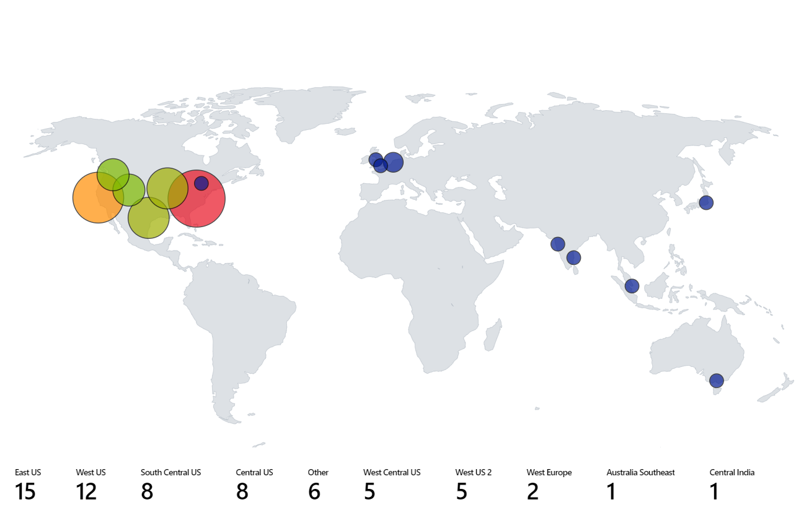
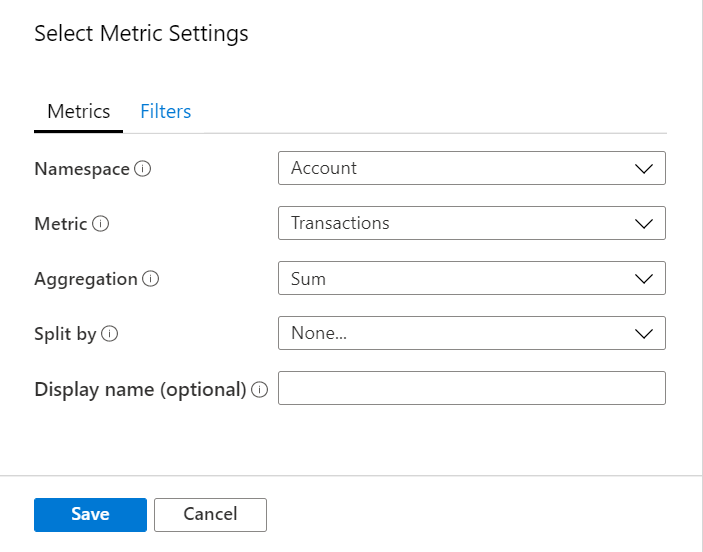
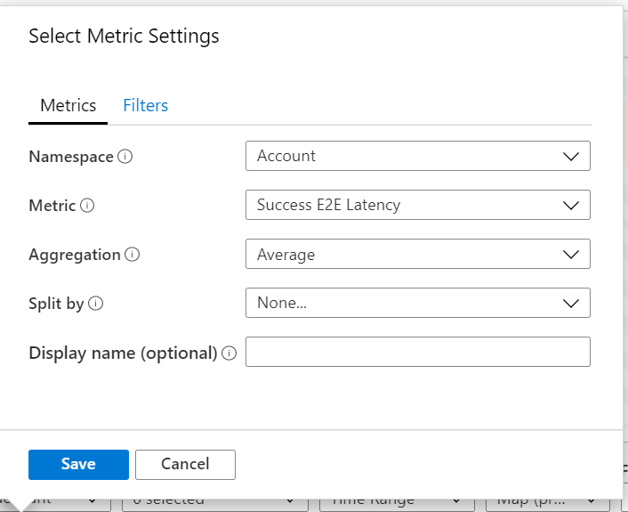

# Map Visualization

Map allows visualizing region specific data, hence aiding in pin-pointing issues with specific regions. This also aids in high level aggregated view of the monitoring data by providing capability to aggregate all the data mapped to each location/country/region.

The image below shows the total transactions and E2E latency for different storage accounts. Here size is determined by the total number of transactions, and the color and metrics below the map shows the E2E latency. Upon the first observation, the number of transactions in the **West US** region are small compared to the **East US** region, but E2E latency for **West US** regions way higher than the **East US** region. This provides initial insight that something is amiss for **West US**.


## Adding a Map
Map can be visualized if the underlying data/metrics has Latitude/Longitude information, Azure resource information, Azure location information, or Country/Region name or Country/Region code.

### Using Azure Location
1. Switch the workbook to edit mode by clicking on the _Edit_ toolbar item.
2. Use the _Add query_ link to add a Azure Resource Graph query control to the workbook.  
3. Select the query type as _Azure Resource Graph_ and then pick any/multiple Subscription which have storage accounts.
4. Use the Query editor to enter the KQL for your analysis and click on Run Query
    ```
    where  type =~ 'microsoft.storage/storageaccounts'
    | summarize count() by location
    ```
5. Set size values to `Large`
6. Set the visualization to _Map_
7. All the settings will be auto-populated. For custom settings, click on _Map Settings_ button to open the settings pane.
8. Below is the map visualization which shows storage accounts for each Azure region for the selected subscriptions.




### Using Azure Resource
1. Switch the workbook to edit mode by clicking on the _Edit_ toolbar item.
2. Use the _Add metric_ link to add a metric control to the workbook. 
3. Use a subscription which has Storage accounts.
4. Select Resource Type as Storage account and in Resource(s) select multiple storage accounts.
5. Add Transactions metric(Image below) and Success E2E Latency metric(Image below).
6. Set size values to `Large`
7. Set the visualization to _Map_
8. _Map Settings_ pane will be automatically opened.
9. Set the following settings (Some of the values will be auto-populated):
    1. Location Info using: `Azure Resource`
    2. Azure resource field: `Name`
    3. Size by: `microsoft.storage/storageaccounts-Transaction-Transactions`
    4. Aggregation for location: `Sum of values`
    5. Coloring Type: `Heatmap`
    6. Color by: `microsoft.storage/storageaccounts-Transaction-SuccessE2ELatency`
    7. Aggregation for color: `Sum of values`
    8. Color palette: `Green to Red`
    9. Minimum value: `0`
    10. Metric Value: `microsoft.storage/storageaccounts-Transaction-SuccessE2ELatency`
    11. Aggregate other metrics by: `Sum of values`
    12. Select the custom formatting checkbox
    13. Unit: `Milliseconds`
    14. Style: `Decimal`
    15. Maximum fractional digits: `2`





### Using Country/Region
1. Switch the workbook to edit mode by clicking on the _Edit_ toolbar item.
2. Use the _Add query_ link to add a log query control to the workbook.  
3. Select the query type as _Log_, resource type as Application Insights and then pick any Application Insights resource which has pageViews data.
4. Use the Query editor to enter the KQL for your analysis and click on Run Query
    ```
    pageViews
    | project duration, itemCount, client_CountryOrRegion
    | limit 20
    ```
5. Set size values to `Large`
6. Set the visualization to _Map_
7. All the settings will be auto-populated. For custom settings, click on _Map Settings_ button to open the settings pane.


### Using Latitude/Location
1. Switch the workbook to edit mode by clicking on the _Edit_ toolbar item.
2. Use the _Add query_ link to add a JSON query control to the workbook. 
3. Select the query type as _JSON_ and paste the below JSON data in the query editor and click on Run Query button.
```
[
  {
    "users": 23,
    "displayName": "East Asia",
    "latitude": "22.267",
    "longitude": "114.188"
  },
  {
    "users": 85,
    "displayName": "Southeast Asia",
    "latitude": "1.283",
    "longitude": "103.833"
  },
  {
    "users": 60,
    "displayName": "Central US",
    "latitude": "41.5908",
    "longitude": "-93.6208"
  },
  {
    "users": 9,
    "displayName": "East US",
    "latitude": "37.3719",
    "longitude": "-79.8164"
  },
  {
    "users": 89,
    "displayName": "East US 2",
    "latitude": "36.6681",
    "longitude": "-78.3889"
  }
]
```
4. Set size values to `Large`
5. Set the visualization to _Map_
6. _Map Settings_ pane will be automatically opened.
7. Set the `Metric Label` in Metric Settings  to displayName and click on `Save and Close`
8. Below is the map visualization which shows users for each latitude and longitude location with the selected label for the metrics.


## Map Settings has three sub-sections:
1. [Layout Settings](#layout-settings)
2. [Color Settings](#color-settings)
3. [Metrics Settings](#metrics-settings)

### Layout Settings

| Setting | Explanation |
|:------------- |:-------------|
| `Location Info Using` | Select a way to get location of items shown on the map. <ul><li> **Latitude/Longitude**: Select this options if there are columns with latitude and longitude information. Each row with latitude and longitude data will be shown as distinct item on the map. </li> <li>**Azure location**: Select this options if there is a column which has [Azure Location](http://www.azurespeed.com/Information/IpRange) (eastus, westeurope, centralindia, etc.) information. Specify that column and we will fetch the corresponding latitude and longitude for each Azure location, group same location rows(based on Aggregation specified) together to show the locations on the map. </li><li>**Azure resource**: Select this options if there is a column which has Azure resource information(storage account, cosmosdb account, etc). This is how the Azure resource looks: "/subscriptions/{subscriptionId}/resourceGroups/{resourceGroupName}/providers/Microsoft.Storage/storageAccounts/{accountName}. Specify that column and we will fetch the corresponding latitude and longitude for each Azure resource, group same location(Azure location) rows(based on Aggregation specified) together to show the locations on the map. </li> <li>**Country/Region**: Select this options if there is a column which has country/region name/code (US, United States, IN,  India, CN, China) information. Specify that column and we will fetch the corresponding latitude and longitude for each Country/Region/Code and group the rows together with same Country-Region Code/Country-Region name to show the locations on the map. Note: Country Name and Country code won't be grouped together as a single entity on the map. </li> </ul>|
| `Latitude/Longitude` | These two option will be visible if Location Info field value is: Latitude/Longitude. Select the column which has latitude in the latitude field and longitude in the longitude field respectively. |
| `Azure location field` | This option will be visible if Location Info field value is: Azure location. Select the column which the Azure location information. |
| `Azure resource field` | This option will be visible if Location Info field value is: Azure resource. Select the column which the Azure resource information. |
| `Country/Region field` | This option will be visible if Location Info field value is: Country or region. Select the column which the Country/Region information. |
| `Size by` | This option controls the size of the items shown on the map. Size depends on value in the column specified by the user. Currently, radius of the circle is directly proportional to the square root of the column's value. If 'None...' is selected, all the circles will show the default region size.|
| `Aggregation for location` | This field specifies how to aggregate the **size by** column's which has same Azure Location/Azure Resource/Country-Region. |
| `Minimum region size` | This field specifies what is the minimum radius of the item shown on the map. This is used when there is a big difference between the size by column's values, therefore smaller items are hardly visible on the map. |
| `Maximum region size` | This field specifies what is the maximum radius of the item shown on the map. This is used when the size by column's values are extremely large and they are covering huge area of the map.|
| `Default region size` | This field specifies what is the default radius of the item shown on the map. The default radius is used when the Size By column is 'None...' or the value is 0.|
| `Minimum value` | The minimum value used to compute region size. If not specified, the minimum value will be the smallest value after aggregation. |
| `Maximum value` | The maximum value used to compute region size. If not specified, the maximum value will be the largest value after aggregation.|
| `Opacity of items on Map` | This field specifies how transparent are the items shown on the map. Opacity of 1 means, no transparency, where opacity of 0 means, items won't be visible on the map. If there are too many items on the map, opacity can be set to low value so that all the overlapping items are visible.|


### Color Settings

| Coloring Type | Explanation |
|:------------- |:-------------|
| `None` | All nodes have the same color |
| `Thresholds` | In this type, cell colors are set by threshold rules (e.g. _CPU > 90%  => Red, 60% > CPU > 90% => Yellow, CPU < 60% => Green_) <ul><li> **Color by**: Value of this column will be used by Thresholds/Heatmap logic.</li> <li>**Aggregation for color**: This field specifies how to aggregate the **color by** column's which has same Azure Location/Azure Resource/Country-Region. </li> <ul> |
| `Heatmap` | In this type, the cells are colored based on the color palette and Color by field. This will also have same **Color by** and **Aggregation for color** options as in the case of thresholds. |


### Metric Settings
| Setting | Explanation |
|:------------- |:-------------|
| `Metric Label` | This option will be visible if Location Info field value is: Latitude/Longitude. Using this feature, user can pick the label to show for metrics shown below the map. |
| `Metric Value` | This field specifies metric value to be shown below the map. |
| `Create 'Others' group after` | This field specifies the limit before an "Others" group is created. |
| `Aggregate 'Others' metrics by` | This field specifies the aggregation used for "Others" group if it is shown. |
| `Custom formatting` | This is same as grid's custom formatting. More description [here](https://github.com/microsoft/Application-Insights-Workbooks/blob/master/Documentation/Visualizations/Grid.md#custom-number-formatting).| 


