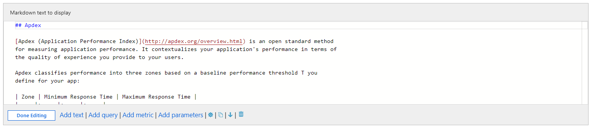

# Text Visualization

Workbooks allow authors to include text blocks in their workbooks. The text can be human analysis of the telemetry, information to help users interpret the data, section headings, etc. 

Text is added through a markdown control - into which an author can add their content. An author can leverage the full formatting capability of markdown to make their documents appear just how they want it. These include different heading and font styles, hyperlinks, tables, etc. This allows authors to create rich Word- or Ibiza-like reports or analytic narratives.

## Add a text control
1. Switch the workbook to edit mode by clicking on the _Edit_ toolbar item.
2. Use the _Add text_ link to add a text control to the workbook. 
3. Add markdown to the control.
4. Click the _Done Editing_ button to see the formatted text.

> Tip: Use this [markdown cheat sheet](https://github.com/adam-p/markdown-here/wiki/Markdown-Cheatsheet) to see the different formatting options.
