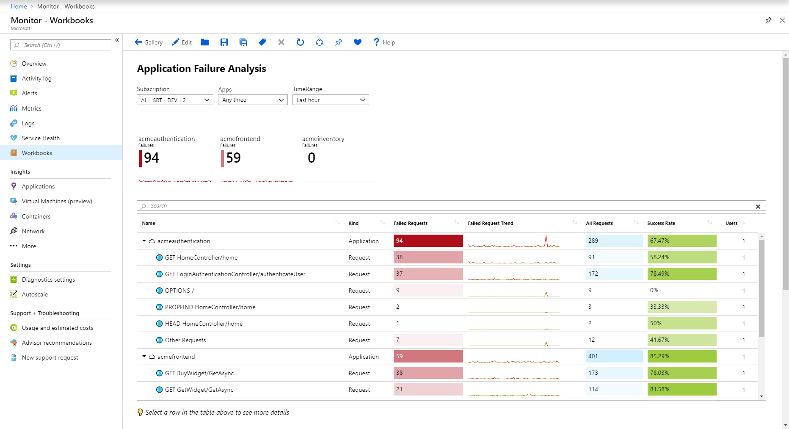

# Azure Monitor Workbook Templates 

## Contributing

This project welcomes contributions and suggestions.  Most contributions require you to agree to a 
Contributor License Agreement (CLA) declaring that you have the right to, and actually do, grant us 
the rights to use your contribution. For details, visit https://cla.microsoft.com.

This project has adopted the [Microsoft Open Source Code of Conduct](https://opensource.microsoft.com/codeofconduct/).
For more information see the [Code of Conduct FAQ](https://opensource.microsoft.com/codeofconduct/faq/) or
contact [opencode@microsoft.com](mailto:opencode@microsoft.com) with any additional questions or comments.

## What is this repository for?
This repository contains the templates shown in the workbook galleries of [Azure Monitor Workbooks](https://docs.microsoft.com/azure/application-insights/app-insights-usage-workbooks). Templates added to this repository will show up in the various Workbook Galleries for users of Azure Monitor Workbooks. By contributing templates, you can help others solve interesting problems using the workbooks you've found helpful on your own team.

## Azure Monitor Workbooks

Workbooks allow Azure Monitor users to create customizable interactive reports and analytic narratives by providing a flexible canvas that allows them to:

1.	Create rich visual reports and analytics experiences within the Azure portal.
2.	Use metric, log and Azure Resource Graph data
3.	Build interactive experiences based on user input
4.	Customize their analysis and persist for later use.
5.	Use templates for curated analysis from a public gallery
6.	Leverage ARM programmability to create and manage their workbook assets.

These capabilities of workbooks can be used to create curated and customized reports, analytic narratives, dashboards, etc. 

Use these links to learn more about workbooks:

* [Data Sources](Documentation/DataSources/DataSources.md)
* [Visualizations](Documentation/Visualizations/Visualizations.md)
* [Parameters](Documentation/Parameters/Parameters.md)
* [Interactivity](Documentation/Interactivity.md)
* [Manage programmatically](Documentation/Programmatically.md)
* [Sample Gallery](Documentation/Samples/Samples.md)
* [Testing](Documentation/Testing/PreviewTemplates.md)

### Sample Workbook 

## How to contribute?
The template contribution process is as simple creating a PR against this repo. The templates need to be in a specific format that is documented here: [Contributing](Documentation/Contributing.md). 

Note that templates in this repo will show up for all users of Azure who open the specified gallery. For this reason, the templates gallery is curated by Microsoft. If the submitted template is useful to the community and it does not place undue stress on the underlying infrastructure, it will be accepted to be part of the gallery.