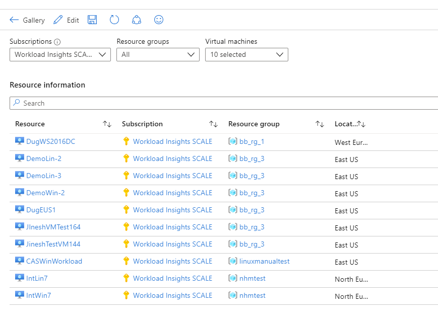
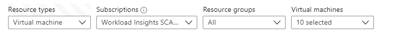

# Picking a set of resources to analyze in workbooks

The `Resource Picker` template gets you started with subscription, resource group and resource parameters to set up the input context of your workbook. The default parameters are set to pick virtual machines, but you can configure it to pick any type of resource. The template also has a ARG query control that shows you how to use the parameters in your analyses.



## Setting up the resource type to pick

1. Use `Edit` on the workbook toolbar.
2. You will now be able to see a drop down `Resource type` before `Subscriptions`:

    
3. Expand the drop down and select the resource types you want picked. This will update the subscription, resource group and resources drop down to match your selection.
4. Click the `Edit` button at the bottom right of the parameter control.
5. In the parameters grid, for the row `Resources`, change the `Display name` column from _Virtual machines_ to friendly name of your selected resource type (e.g. _Storage Accounts_)
6. Click `Done Editing` in the workbooks toolbar.

## Selecting more or less than 10 resources by default

1. Use `Edit` on the workbook toolbar.
2. Click the `Edit` button at the bottom right of the parameter control.
3. In the parameters grid, select the row for `Resources`
4. Click on the `Edit` (or pencil) icon control toolbar.
5. In the `Edit Parameter` pane that pops up, scroll down to the `Azure Resource Graph Query` editor. It should have a query that looks like this:
    ```sql
    Resources
    | where type in~({ResourceTypes})
    | extend resourceGroupId = strcat('/subscriptions/', subscriptionId, '/resourceGroups/', resourceGroup)
    | where resourceGroupId in~({ResourceGroups}) or '*' in~({ResourceGroups})
    | order by name asc
    | extend Rank = row_number()
    | project value = id, label = name, selected = Rank <= 10, group = resourceGroup
    ```
    The code for resource selection is in the last line of the query: `selected = Rank <= 10`. 

6. Change the value from 10 to a different one to change the default selection