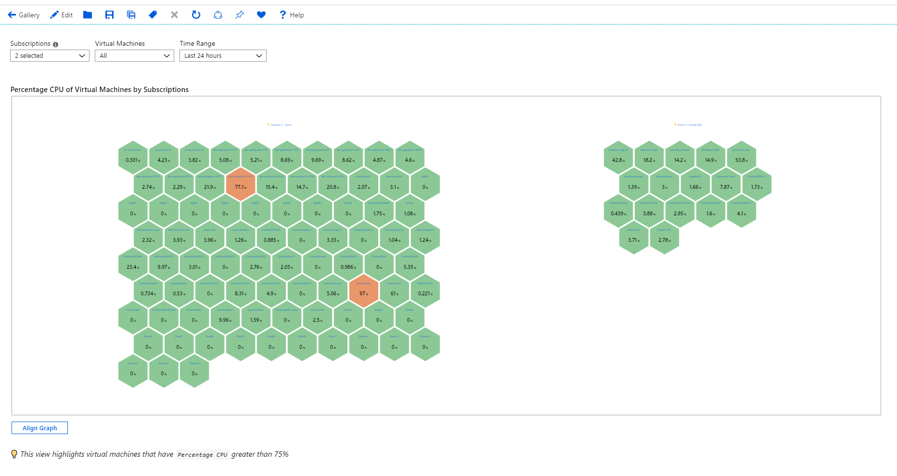
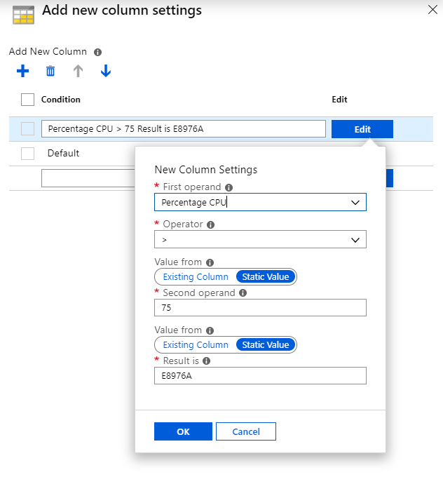

# CPU heatmap

This workbook is a good way to visualize hot spots in the CPU utilization of your virtual machines.

## Changing the CPU threshold
By default, this workbook highlights virtual machines with average `Percentage CPU` greater than 75%. If you wish for this threshold to be higher or lower, these are the steps for follow:

1. Click the `Edit` item in the toolbar.
2. Click on the `↑ Edit` button to the bottom-right of the hive control.
3. In the `Columns Available After Merge` list, scroll down and select the `[Added column] - Cell Color` item.
4. Click on the `Edit added item` button in the hive controls toolbar.
5. In the pane tha opens up, click `Edit` on the item that says `Percentage CPU > 75 Result is E8976A` to see a settings pop up
    1. Set the `Second operand` field to the threshold you want - say 90.
        
    2. Click op in the popup.
6. Click 'Save and close'
7. Choose `Done Editing` in the workbook toolbar.
